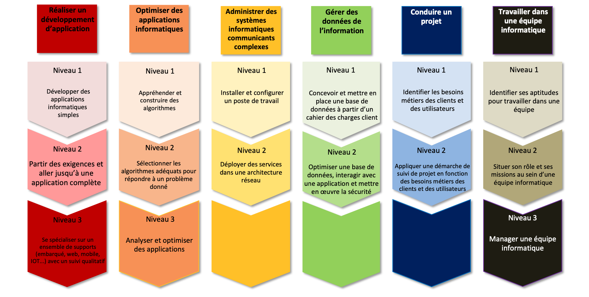

## Portfolio

#### Compétence 1 : Réaliser un développement d'application

##### Niveau 1 : Développer des applications informatiques simples
###### R1.01    R1.02   R1.10   S1.01

##### Niveau 2 : 
##### Niveau 3 : 

#### Compétence 2 : Optimiser des applications informatiques

##### Niveau 1 : Appréhender et construire des algorithmes
###### R1.01    R1.03    R1.04    R1.06    R1.07    S1.02
##### Niveau 2 : 
##### Niveau 3 : 

#### Compétence 3 : Administrer des systèmes informatiques communiquants complexes

##### Niveau 1 : Installer et configurer un poste de travail
###### R1.03    R1.04   R1.10   R1.11   S1.03
##### Niveau 2 : 

#### Compétence 4 : Gérer des données de l'information

##### Niveau 1 : Concevoir et mettre en place une base de données à partir d'un cahier des charge clients
###### R1.05    R1.06   R1.09   S1.04
##### Niveau 2 : 

#### Compétence 5 : Conduire un projet

##### Niveau 1 : Identifier les besoins métiers des clients et des utilisateurs
###### R1.02    R1.08   R1.11   S1.05
##### Niveau 2 : 

#### Compétence 6 : Travailler dans une équipe informatique

##### Niveau 1 : Identifier ses aptitudes pour travailler dans une équipe
###### R1.02    R1.08   R1.09   R1.10   R1.11   R1.12   S1.06
##### Niveau 2 : 
##### Niveau 3 : 

### Mes compétences

##### R1.01
Je travaille beaucoup sur cette matière qui, selon moi, est l'une des matières qui me servira la plus dans ma vie.
Je prend du temps afin de bien comprendre, terminer tous les TPs ainsi que la documentations qui va avec.
Selon moi un code non documenté n'est pas très utile, pour soi, mais inutilisable pour les autres.
Tous mes travaux sont postés sur mon GitHub afin de toujours garder une trace de mon travail et aussi pour voir mon évolution.
[Lien vers mes travaux de R1.01](https://github.com/colasnaudi/BUT-INFO/tree/Initiation-au-developpement/S1/R1.01-Initiation-au-developpement)

##### R1.02
J'affectionne particulièrement cette matière car j'adore créer des choses et faire parler ma créativité. Le fait de créer des maquettes d'applications est aussi une partie importante pour concevoir une application. C'est donc très intéréssant. De plus on nous a appris lors des séances de TPs à créer notre CV sous forme de site web en HTML/CSS. Je trouve cela très bien car si on cherche un job dans l'informatique, le CV en ligne fait toujours son effet.
[Lien vers mes travaux de R1.02](https://github.com/colasnaudi/BUT-INFO/tree/Initiation-au-developpement/S1/R1.02%20Interfaces%20web)

##### R1.03

##### R1.04

##### R1.05

##### R1.06

##### R1.07

##### R1.08

##### R1.09

##### R1.10
Selon moi, dans l'informatique l'anglais est plus que nécessaire à maîtriser. La plupart des logiciels mais aussi forum d'aide, formations sur l'informatique... sont en anglais, donc si on ne le maîtrise il sera très compliqué de trouver des informations rapidement. Ensuite, si l'on veut partager son code au monde entier, le minimum est de le documenter en anglais car c'est la langue la plus parlée en général.
[Lien vers mes travaux de R1.10](https://github.com/colasnaudi/BUT-INFO/tree/Initiation-au-developpement/S1/R1.10%20Anglais)

##### R1.11

##### R1.12

##### S1.01
Cette SAÉ été très formatrice car elle a démarré très tôt dans l'année ce qui nous a poussé à essayer d'apprendre par nous même, tout en adaptant notre travail avec les méthodes vues en cours plus tard. Ce projet a été divisé en 2 jeux de difficultés croissantes. Pour chaque jeux nous devions fournir le code ainsi qu'un livrable explicatif pour le code, contenant algorithmes & dictionnaires de données.
Le plus dur à faire dans ce projet est de se partager les tâches car tout le monde veux coder, il faut donc trouver un juste milieu pour que tout le monde travaille autant sur le projet. Personnellement, sur le premier jeu, je l'avais fini de mon côté en 1 journée mais pour mon binôme cela n'aurait pas été formateur de lui donner le code directement fait. Je l'ai donc aidé lorsqu'il ne savait pas comment faire et cela m'a forcé à expliquer la manière de coder ce qui n'est pas forcément évident. Cet exercice a aussi fait que maintenant je sais expliquer n'importe quel morceau de mon code.
Ensuite le plus long est de documenter le code mais c'est aussi une bonne chose car ça nous apprend à faire comprendre notre code aux autres.
Ce projet nous apprend la gestion de projet, au niveau de la répartition des tâches et du respect des dates limites pour le rendu.
[Lien vers mes travaux de S1.01](https://github.com/colasnaudi/BUT-INFO/tree/Initiation-au-developpement/S1/S1.01%20Implémentation%20besoin%20d'un%20client)

##### S1.02

##### S1.03

##### S1.04

##### S1.05

##### S1.06