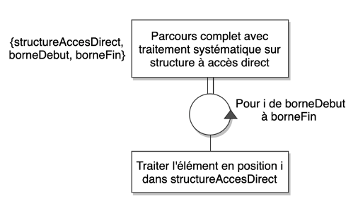
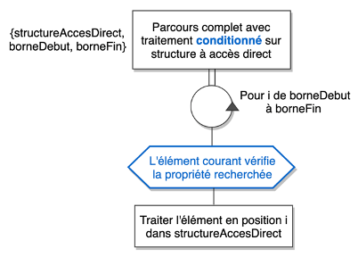
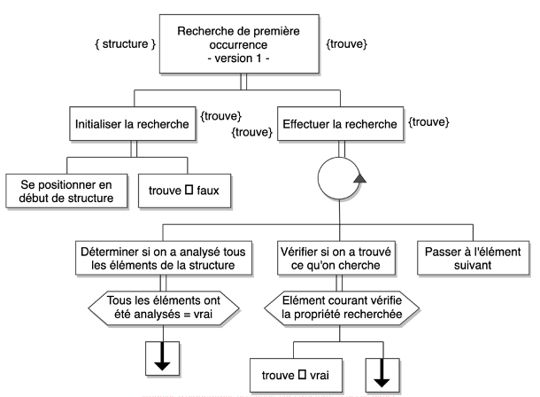

# R1.01 Initiation au développement

## Partie 1

### Tutoriel vidéos et Supports de cours

*Qu'est-ce qu'un algorithme ?*

Un algorithme est la spécification d'un schéma de calcul, sous forme d'une suite [finie] d'opérations élémentaires obéissant à un enchaînement déterminé.

Travail réalisé lorsque l'on élabore un algorithme

- Cerner le problème à résoudre
- Identifier les étapes de résolutions d'un problème
- Définir l'ordre de réalisation des étapes
- Décrire la solution de manière non ambiguë

### **Bonnes pratiques**

- Nommer les variables avec des noms significatifs.
- Les noms de fichier et les variables ne doivent pas contenir d'accents ou de caractères spéciaux.
- Typer le plus précisément la variable.
- Si la variable est une constante le nom doit être écrit tout en majuscule.
- Si notre variable est composée de plusieurs mots elle devra être écrite en minuscule avec une majuscule pour chaque début de mots.
- Le code doit être bien indenté.
- Les variables et les traitements doivent pouvoir être distingués facilement dans le code.
- Pour chaque nouveau traitement indiquer à l'aide de commentaire de quel traitement il s'agit.
- Même s'il n'y a qu'une seule action après un if, un else, une boucle for, une boucle do while ou une boucle while il est préférable de mettre des accolades cela rend le code plus lisible, améliore sa maintenabilité et évite des cas d'erreurs difficile à trouver.
- Prendre le temps d'identifier la structure itérative la plus adaptée.
- Utiliser un compilateur pour les erreurs de syntaxe.
- Utiliser un deboggeur pour les erreurs de fonctionnement du programme.

### Opérations

ET logique ( && )

```cpp
if( (nb1 > 0) && (nb2 > 0) )
{
		/* code */
}
```
OU logique ( || )

```cpp
if( (nb1 > 0) || (nb2 > 0) )
{
		/* code */
}
```

Racine carrée ( sqrt )

```cpp
#include <math.h>

sqrt(variable ou expression)
```

Modulo ( % )

```cpp
//Savoir si un chiffre est pair : modulo 2
if (nb%2==0)
{
		estPair = true;
}
```

## **3 - LA DECOMPOSITION ALTERNATIVE**

**if (si)**

Si la condition est vérifiée on fait l'instruction 1 sinon on ne fait rien.

```cpp
if (/* condition */)
{
		/* code */
}
```

**if else (si sinon)**

Si la première condition est vérifiée alors on fait l'instruction 1 sinon si elle n'est pas vérifiée alors on fait l'instruction 2.

```cpp
if (/* condition */)
{
		/* code */
}
else
{
		/* code */
}
```

**if else if (si sinon si)**

Si la première condition est vérifiée alors on fait l'instruction 1 sinon si elle n'est pas vérifiée alors ON ESSAYE de vérifier la deuxième, si elle n'est pas vérifiée on ne fait rien sinon on fait l'instruction 2.

```cpp
if (/* condition */)
{
		/* code */
}
else if (/* condition */
{
		/* code */
}
```

**Switch**

A utiliser lorsque les conditions à vérifier sont distinctes les unes des autres.

ne pas oublier les break; pour sortir.

default pour tout les autres cas équivalent au sinon.

```cpp
switch (expression)
{
case /* constant expression */:
		/* code */
		break;
default:
		break;
}
```

## **4 - LA DECOMPOSITION ITERATIVE**

For : pour les boucles à nombres de tours connus

Pour une boucle for si la variable d'initialisation est supérieure à la variable de la condition de continuation alors la boucle ne se fera pas.

**While**

pour les boucles avec la condition de sortie traitée dès l'entrée dans la boucle

```cpp
while (/* condition */)
{
		/* code */
}
```

**Do While**

pour les boucles avec la condition de sortie traitée à la fin de la boucle

```cpp
do
{
		/* code */
}while (/* condition */);
```

**While(true) ou for ( ; ; ; )**

pour les boucles à nombres de tours inconnus et avec une ou plusieurs conditions de sortie au milieu de la boucle.

```cpp
while (true)
{
		/* code */
}
```

## **5 - DEBOGAGE**

### **MANUELLEMENT**

Permet de voir quelle instruction du code pose un problème pour afficher le bon résultat, même si le code est syntaxiquement correct et compile.

Identifier les différentes parties du code et afficher à l'écran "Étape numéro .." pour chaque partie afin de voir à quel moment le problème est rencontré.

Dès que l'endroit est identifié, il faut décomposer encore en plusieurs étapes (exemple : à l'intérieur d'une boucle). "Boucle - Étape ..."

Dès que l'instruction qui pose un problème est identifiée, afficher toutes les variables qui jouent un rôle dans l'instruction.

Corriger l'erreur. Compiler et exécuter.

### **VIA UN DEBOGGEUR**

Point d'arrêt = permet au débuggeur de savoir quand arrêter l'exécution du programme. Sous forme d'étapes.

En placer pour chaque partie du code afin d'identifier le problème.

Passer en mode "exécuter et debugger" et debugger grâce à la flèche verte placée en haut de la fenêtre.

VARIABLES = Liste toutes les variables du programme et affiche les valeurs de chacune avant d'exécuter l'instruction de la ligne où le point d'arrêt a été placé.

Cliquer sur le bouton suivant pour aller au prochain point d'arrêt.

Le débuggeur affiche un message d'erreur sur l'instruction qui pose problème (exemple : division par 0).

Lorsque le problème est identifié, arrêter le débuggeur.

Corriger le programme (exemple : dans la boucle for ne plus faire aller i jusqu'à 0 mais jusqu'à 1).

Enlever les points d'arrêt.

Revenir à l'exécution normal.

Le programme fonctionne.

**ESPION**

Exemple : quotient > 0

L’espion répond par True ou False à chaque expression entrée au cours du débogage.

## **6 - TYPES ENUMERES, ENREGISTREMENTS & TABLEAUX**

### **Types énumérés**

Type défini à partir d’une liste de valeur finie.

```cpp
enum nomDuType {valeur1, valeur2, ..., valeurN}; 
```

**Déclaration des variables**

```cpp
//Définition du type UnJour
enum UnJour {lundi, mardi, mercredi, jeudi, vendredi, samedi, dimanche};

//Déclaration des deux variables de type UnJour
UnJour premierJourSemaine = lundi;
UnJour dernierJourSemaine = dimanche;
```

*Les valeurs lundi et dimanche ne sont pas des chaînes de caractères mais des valeurs de type UnJour.*

Opérations possibles :

- Affectation entre variables de même type
- Comparaisons
- Affichage (cout) mais saisie (cin) interdit

### **Enregistrements**

Accès aux attributs

```cpp
struct UneAdresse
{
		unsigned short int numRue;
		string nomRue;
		unsigned int codePostal;
		string nomVille;
};

UneAdresse adresseIut = {7, "Montaury", 64100, "Anglet"};

//Afficher la ville de l'adresse de l'IUT
cout << adresseIut.nomVille << endl;
```

Opérations autorisées :

- Accès aux attributs via la notation pointée
- Affectation entre variables de même type

Pour saisir, afficher ou comparer il est impossible d’écrire le nom de la variable directement, il faut comparer les attributs à l’aide de pointeur.

Il est aussi possible d’imbriquer des enregistrements s’ils sont déclarés dans le bon ordre.

**Tableaux**

Tableau **statique** = taille fixe

Tableau **dynamique** = taille qui évolue au cours de l’exécution du programme

Tableau statique avec taille prédéfinie

```cpp
const unsigned short int NB_CASES = 10; //Nombre de cases du tableau
float note[NB_CASES]; //Tableau contenant les notes
```

Accès aux éléments du tableau :

- L’indice du premier élément est 0.
- L’indice du dernier élément du tableau est égal à NB_CASES – 1.

Pour afficher la **5ème valeur** ont écrit **cout << note[4] ;**

**Tableau à deux dimensions**

```cpp
int tab[3][4]; //Déclaration d'un tableau de 3 lignes et 4 colonnes
```

## **7 - ALGORITHMES AVEC STRUCTURE A ACCES DIRECT**

**Parcours complet avec traitement systématique**



*Sens du parcours*

*Positionner en début de structure*

*Passer à l’élément suivant*

*Fin de parcours*

*Traitement à appliquer à tous les éléments*

**Parcours complet avec traitement conditionné**



*Sens du parcours*

*Positionner en début de structure*

*Passer à l’élément suivant*

*Fin de parcours*

*Condition pour que l’élément courant soit traité*

*Quel traitement doit-on lui appliquer*

**Recherche de première occurrence**



*Sens du parcours*

*Positionner en début de structure*

*Passer à l’élément suivant*

*Fin de parcours*

*Condition pour vérifier que l’élément courant vérifie la propriété*

## **8 - PROCEDURES**

**Paramètres formels :** Déclaration & définition

**Paramètres effectifs :** Appel

**0 à N données et 0 à N résultats.**

**Déclaration de la procédure :**

```cpp
void nomDeLaProcedure (typeParametre nomParametreFormel);
// BUT :
```

**Définition de la procédure :**

```cpp
void nomDeLaProcedure (typeParametre nomParametreFormel)
{
		//Code de la procédure
}
```

**Appel de la procédure**

```cpp
nomDeLaProcedure (nomParametreEffectif);
```

### **Passage de paramètres :**

- **Par valeur**

Le paramètre transmis par valeur est protégé car le sous-programme travaille sur une copie, **il ne peut pas être modifié**.

- **Par référence**

Reçois le paramètre directement et non une copie. On utilise **le symbole &** après le type du paramètre pour indiquer qu’il sera transmis par référence.

Le symbole se **rajoute au niveau de la déclaration et de la définition** mais pas au niveau de l’appel.

- **Par référence constante**

Similaire au passage par référence mais la valeur n’est pas modifiable par le sous-programme. On utilise toujours le **symbole &** mais on rajoute le **mot clé const** qui indique que **la valeur ne peut pas être modifiée**.

**Les tableaux sont transmis par référence par défaut**

Les tableaux peuvent être passé par **référence constante** et dans ce cas le tableau ne sera pas modifié (dans le cas d’une recherche, le tableau est parcouru mais pas modifié).

### **Bonnes pratiques**

- Ranger les paramètres dans l’ordre données/résultats
- Paramètres d’états ou d’erreurs en dernier
- Utiliser tous les paramètres d’un sous-programme sinon retirer-les
- Ne pas employer de paramètres comme variables de travail, plutôt utiliser des variables locales.
- Limiter le nombre de paramètres du sous-programme
- Documenter le sous-programme

## **9 - FONCTIONS**

**Comme une procédure mais on n’utilise pas void mais le type de la variable retournée.**

**Ex :**

```cpp
double max (double nb1, double nb2)
{
		return nb1 > nb2 ? nb1 : nb2;
}
```

Appel de fonctions :

Pour s’en servir on doit soit la stocker dans une variable du programme principal

```cpp
maximum = max (2,12);
```

Soit l'utiliser comme n'importe quelle variable

```cpp
cout << max (2,12) << endl;
```

**La fonction static_cast** est généralement utilisée pour **convertir des types** liés en tant que pointeurs de la même hiérarchie de classes ou de types numériques entre eux. Cette commande gère également les conversions définies par les constructeurs et les opérateurs de conversion.

```cpp
static_cast<type>(variable);
```

#### **Fonctions ou procédures ?**
| Fonctions | Procédures |
| ----------- | ----------- |
| Retourne une valeur | Ne retourne aucune valeur |
| Contient au moins une instruction return | Ne contient aucune instruction return |
| Ne produit qu’un résultat | Produit de 0 à N résultat |
| Est homogène à une valeur | Est homogène à une instruction |
| Les appels peuvent être imbriqués | Les appels ne peuvent pas être imbriqués |

### **Bonnes pratiques**

- Selon les puristes un seul return
- Les return multiples peuvent améliorer la visibilité du code mais il faut les utiliser avec précaution.
- Les sous-programmes doivent être courts
- Les sous-programmes font une seule tâche précise, si besoin, décomposer le sous-programme en plusieurs.
- Bien nommer les sous-programmes