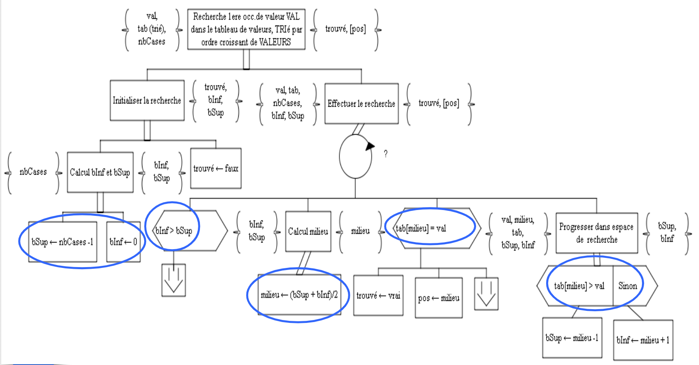

# R1.01 Initiation au développement

## Partie 2

### Chapitre 2 - Modularité & Organisation du code

Utiliser un module en C++

**#include nomDeFichier** dans le fichier qui l'utilise

**#include <nomDeFichier>** : Chercher le fichier d'abord dans les chemins pré-configurés du compilateur, puis dans le même répertoire que le fichier source incluant le module.

**Exemple :**
```cpp
// Bibliothèques standards
#include <iostream>
#include <cmath>
```

**#include "nomDeFichier"** : Chercher le fichier d'abord dans le même répertoire que le fichier source incluant le module, puis dans les chemins pré-configurés du compilateur.

**Exemple :**
```cpp
// Liaisons de modules
#include "math.h"
#include "game-tools.h"
```

#### Création d'un module en C++

- Un fichier nomFichierDeMonModule.h
    
    Interface ou fichier d'en-tête du module, il présente les services offerts par le module mais pas leur implémentation.
    
- Un fichier nomFichierDeMonModule.cpp
    
    Corps du module, il contient le code implémentant (mettant en oeuvre) les services rendus par le module.
    

**Dans le fichier .h on y trouve :**

- Des gardes d'inclusions : qui indique de le compiler qu'une seule fois
    
    #ifndef NOMMODULE_H
    
    #define NOMMODULE_H
    
    #endif
    
- Des directives d'inclusions : nécessaires au fichier .h
- Définitions des types
- Les déclarations et initialisations des constantes et les déclarations des variables
- Les déclarations des sous-programmes

**Dans le fichier .cpp on y trouve :**

- Une directive d'inclusion de l'interface du module
    
    #include "nomModule.h" et d'autres si nécessaires
    
- Les définitions de tous les sous-programmes déclarés dans l'interface
- Les types, constantes variables utilisées uniquement dans le corps du module
- Les déclarations et définitions des sous-programmes utilisés uniquement dans le corps du module.

#### **Notion de Portée**

La portée d'une entité est la région de code dans laquelle cette entité est utilisable.

La portée d'une entité dépend de l'endroit où elle a été déclarée.

Une entité peut être (une variable, un type, une constante, un sous-programme, un module).

Portée d'un module : à partir de la ligne où elle a été déclarée jusqu'à la fin du bloc ou elle a été déclarée.

### Chapitre 3 - Modèles d’algorithmes sur collections d’éléments homogènes

#### Parcours séquentiel complet avec traitement systématique sur la structure

##### Quand l'utiliser ?
Lorsque l’on doit appliquer un même traitement à tous les éléments d’une collection

##### Pré-conditions
La collection doit proposer un mécanisme d’accès séquentiel ou direct

##### A préciser
Sens du parcours

#### Parcours séquentiel complet avec traitementconditionné sur la structure

##### Quand l'utiliser ?
Lorsque l’on doit appliquer un traitement à certains éléments d’une collection : ceux vérifiant une propriété particulière.

##### Pré-conditions
La collection doit proposer un mécanisme d’accès séquentiel ou direct

##### A préciser
Sens du parcours

#### Recherche séquentielle de première occurrence

##### Quand l'utiliser ?
-   Lorsque l’on recherche «le premier»élément d’un ensemble satisfaisant une propriété particulière.
-   Ce «premier» élément peut être différent selon le sens de parcours de la collection.

##### Pré-conditions
La collection doit proposer un mécanisme d’accès séquentiel ou direct

##### Résultat de l'algorithme
-   **Au minimum**, l'algorithme produit un indicateur qui précise si la recherche a abouti ou pas.
-   D'autres résultats peuvent être produits, comme par exemple la position de l'élément trouvé.

#### Recherche dichotomique de première occurence



##### Quand l’utiliser :
-   Lorsque l’on recherche le «premier élément» de la collection satisfaisant une propriété particulière.
-   Ce «premier» élément peut être différent selon la manière de parcourir la collection.

##### Pré-conditions:
-   Les éléments de la collection doivent être triés selon le critère correspondant à la propriété cherchée.
-   La collection doit proposer un mécanisme d’accès direct

##### Remarques :
-   L’ordre des éléments peut être croissant ou décroissant
-   L’ordre des éléments peut ne pas être strict (il peut y avoir des doublons)

##### Conditions d'arrêt
-   La valeur a été trouvée.
-   Tous les éléments ont été parcourus et l'élément n'a pas été trouvé.

##### Comment l'utiliser
-   Diviser par 2 l'espace de travail **(borneSup-borneInf)/2**
-   Voir si c'est la partie inférieur ou supérieur qu'il faut continuer à traiter.
-   Continuer jusqu'à trouver la valeur **OU** atteindre la fin de l'espace de travail.

### Différents types de tris
#### Tri par sélection de places
```cpp
/* -------------------------------------------------------------------------- */
/*                                 DECLARATION                                */
/* -------------------------------------------------------------------------- */
void triParSelectionDePlace (int tab[], unsigned int nbTab);
// BUT : Tri des nbTab (>0) éléments de tab (avec d'eventuels doublons)
//       par ordre croissant de valeur par la méthode de tri de même nom.

/* -------------------------------------------------------------------------- */
/*                                 DEFINITION                                 */
/* -------------------------------------------------------------------------- */
void triParSelectionDePlace (int tab[], unsigned int nbTab)
{
    /* -------------------------------------------------------------------------- */
    /*                                  VARIABLES                                 */
    /* -------------------------------------------------------------------------- */
    unsigned int ici; // Emplacement auquel la valeur doit être traitée
    unsigned int posMax; //La position de l'élément maximum durant le parcours
    /* -------------------------------------------------------------------------- */
    /*                                 TRAITEMENTS                                */
    /* -------------------------------------------------------------------------- */
    /* --------------- Si le tableau contient au minimum 1 valeur --------------- */
    if (NB_CASES > 0)
    {
        for(ici=NB_CASES-1; ici >= 1; ici--)
        {
            posMax = positionDuMax(tab, 0, ici);
            echanger(tab, posMax, ici);
        }
    }
}
```
###### PositionDuMax
```cpp
/* -------------------------------------------------------------------------- */
/*                                 DECLARATION                                */
/* -------------------------------------------------------------------------- */
unsigned int positionDuMax(const int tab[], unsigned int bDeb, unsigned int bFin);
/* -------------------------------------------------------------------------- */
/*                                 DEFINITION                                 */
/* -------------------------------------------------------------------------- */
unsigned int positionDuMax(const int tab[], unsigned int bDeb, unsigned int bFin)
{
    /* -------------------------------------------------------------------------- */
    /*                                  VARIABLES                                 */
    /* -------------------------------------------------------------------------- */
    unsigned int posMax; //La position de l'élément maximum durant le parcours
    /* -------------------------------------------------------------------------- */
    /*                                 TRAITEMENTS                                */
    /* -------------------------------------------------------------------------- */
    /* ----------------------------- Initialisation ----------------------------- */
    posMax = bDeb;

    /* ------- Recherche de la position du nombre maximum entre les bornes ------ */
    for(int i=bDeb; i<= bFin; i++)
    {
        if(tab[posMax] < tab[i])
        {
            posMax = i;
        }
    }
    /* --------- Retourne la position du l'élément max entre bDeb & bFin -------- */
    return posMax;
}
```
###### Echanger
```cpp
/* -------------------------------------------------------------------------- */
/*                                 DECLARATION                                */
/* -------------------------------------------------------------------------- */
void echanger(int tab[], unsigned int& x, unsigned int&y);
/* -------------------------------------------------------------------------- */
/*                                 DEFINITION                                 */
/* -------------------------------------------------------------------------- */
void echanger(int tab[], unsigned int& x, unsigned int&y)
{
    /* -------------------------------------------------------------------------- */
    /*                                  VARIABLES                                 */
    /* -------------------------------------------------------------------------- */
    int copie; // copie du contenu de tab[x] pour effectuer l'échange
    /* -------------------------------------------------------------------------- */
    /*                                 TRAITEMENTS                                */
    /* -------------------------------------------------------------------------- */
    copie = tab[x];
    tab[x] = tab[y];
    tab[y] = copie;
}
```


#### Tri par insertion de valeurs
```cpp
/* -------------------------------------------------------------------------- */
/*                                 DECLARATION                                */
/* -------------------------------------------------------------------------- */
void triParInsertion(int tab[], unsigned int nbTab);
// BUT : Tri des nbTab (>0) éléments de tab (avec d'eventuels doublons)
//       par ordre croissant de valeur par la méthode de tri de même nom.
/* -------------------------------------------------------------------------- */
/*                                 DEFINITION                                 */
/* -------------------------------------------------------------------------- */
void triParInsertion(int tab[], unsigned int nbTab)
{
    /* -------------------------------------------------------------------------- */
    /*                                  VARIABLES                                 */
    /* -------------------------------------------------------------------------- */
    unsigned int ici; // Emplacement auquel la valeur doit être traitée
    /* -------------------------------------------------------------------------- */
    /*                                 TRAITEMENTS                                */
    /* -------------------------------------------------------------------------- */
    /* --------------- Si le tableau contient au minimum 1 valeur --------------- */
    if (NB_CASES > 0)
    {
        for (ici = 1; ici <= NB_CASES-1; ici++)
        {
            insertion(tab, 1, ici);
        }
    }
}
```
###### Insertion
```cpp
/* -------------------------------------------------------------------------- */
/*                                 DECLARATION                                */
/* -------------------------------------------------------------------------- */
void insertion(int tab [], unsigned int bDeb, unsigned int ici);
/* -------------------------------------------------------------------------- */
/*                                 DEFINITION                                 */
/* -------------------------------------------------------------------------- */
void insertion(int tab [], unsigned int bDeb, unsigned int ici)
{
    /* -------------------------------------------------------------------------- */
    /*                                  VARIABLES                                 */
    /* -------------------------------------------------------------------------- */
    unsigned int j; //Indice de case courant
    int copieTab; //Copie de la valeur contenue dans tab[ici]
    /* -------------------------------------------------------------------------- */
    /*                                 TRAITEMENTS                                */
    /* -------------------------------------------------------------------------- */
    /* ----------------------------- Initialisation ----------------------------- */
    copieTab = tab[ici];
    /* ------------- Recherche de l'emplacement où insérer la valeur ------------ */
    for (j = ici; j > 0 && tab[j - 1] > copieTab; j--)
    {
        tab[j] = tab[j - 1];
    }
    /* -------- Copie de la valeur à l'emplacement qu'on le lui a trouvé -------- */
    tab[j] = copieTab;
}
```

#### Tri de la bulle
```cpp
/* -------------------------------------------------------------------------- */
/*                                 DECLARATION                                */
/* -------------------------------------------------------------------------- */
void triBulle (int tab[], unsigned int nbTab);
// BUT : Tri des nbTab (>0) éléments de tab (avec d'eventuels doublons)
//       par ordre croissant de valeur par la méthode de tri de même nom.

/* -------------------------------------------------------------------------- */
/*                                 DEFINITION                                 */
/* -------------------------------------------------------------------------- */
void triBulle(int tab[], unsigned int nbTab)
{
    /* -------------------------------------------------------------------------- */
    /*                                  VARIABLES                                 */
    /* -------------------------------------------------------------------------- */
    unsigned int ici; // Emplacement auquel la valeur doit être traitée
    /* -------------------------------------------------------------------------- */
    /*                                 TRAITEMENTS                                */
    /* -------------------------------------------------------------------------- */

    /* --------------- Si le tableau contient au minimum 1 valeur --------------- */
    if (NB_CASES > 0)
    {
        for (ici = NB_CASES-1 ; ici >= 1; ici--)
        {
            faireMonterLaBulleIci(tab, 0, ici);
        }
    }
}
```
###### FaireMonterLaBulleIci
```cpp
/* -------------------------------------------------------------------------- */
/*                                 DECLARATION                                */
/* -------------------------------------------------------------------------- */
void faireMonterLaBulleIci(int tab[], unsigned int bDeb, unsigned int& ici);

/* -------------------------------------------------------------------------- */
/*                                 DEFINITION                                 */
/* -------------------------------------------------------------------------- */
void faireMonterLaBulleIci(int tab[], unsigned int bDeb, unsigned int& ici)
{
    /* -------------------------------------------------------------------------- */
    /*                                  VARIABLES                                 */
    /* -------------------------------------------------------------------------- */
    int copieTab; // La copie du nombre contenu dans tab[i] pour effectuer l'échange
    /* -------------------------------------------------------------------------- */
    /*                                 TRAITEMENTS                                */
    /* -------------------------------------------------------------------------- */
    for (unsigned int i = bDeb; i <= ici-1; i++)
    {
        if (tab[i] > tab[i+1])
        {
            copieTab = tab[i];
            tab[i] = tab[i+1];
            tab[i+1] = copieTab;
        }
    }
}
```

#### Parcours séquentiel parallèle de 2 collections ordonnées (TriFusion)
```cpp
// Type Etudiant
struct Etudiant
{
    string nom;
    string prenom;
    unsigned int groupeTP;
};

/* -------------------------------------------------------------------------- */
/*                                 DECLARATION                                */
/* -------------------------------------------------------------------------- */
void triFusion(const Etudiant tableau1[], unsigned int NB_CASES1, const Etudiant tableau2[], unsigned int NB_CASES2, Etudiant tabFusion[], unsigned int NB_CASES);
// BUT : Fusionne deux tableau tableau1 et tableau2 en un tableau triFusion et tri
//       les élements par ordre croissant de valeur par la méthode de tri de même nom.

/* -------------------------------------------------------------------------- */
/*                                 DEFINITION                                 */
/* -------------------------------------------------------------------------- */
void triFusion(const Etudiant tableau1[], unsigned int NB_CASES1, const Etudiant tableau2[], unsigned int NB_CASES2, Etudiant tabFusion[], unsigned int NB_CASES)
{
    /* -------------------------------------------------------------------------- */
    /*                                  VARIABLES                                 */
    /* -------------------------------------------------------------------------- */
    unsigned int indice1; // Indice de parcours de tableau1
    unsigned int indice2; // Indice de parcours de tableau2
    unsigned int indice; // Indice de parcours du tableau triFusion
    /* -------------------------------------------------------------------------- */
    /*                               INITIALISATION                               */
    /* -------------------------------------------------------------------------- */
    indice1 = 0;
    indice2 = 0;
    indice = 0;

    while(!((indice1 == NB_CASES1) && (indice2 == NB_CASES2)))
    {
        /* ----------- S'il n'y a plus d'éléments à traiter dans tableau1 ----------- */
        if((indice1==NB_CASES1)&&(indice2<=NB_CASES2))
        {
            tabFusion[indice] = tableau2[indice2];
            indice2++;
            indice++;
        }
        /* ----------- S'il n'y a plus d'éléments à traiter dans tableau2 ----------- */
        else if((indice1<=NB_CASES1)&&(indice2==NB_CASES2))
        {
            tabFusion[indice] = tableau1[indice1];
            indice1++;
            indice++;
        }
        else
        {
            /* ------- Si le nom de l'élément courant du tableau2 est supérieur à ------- */
            /* ----------------- celui de l'élément courant du tableau1 ----------------- */
            if(tableau1[indice1].nom < tableau2[indice2].nom)
            {
                tabFusion[indice] = tableau1[indice1];
                indice1++;
                indice++;
            }
            /* ------- Si le nom de l'élément courant du tableau1 est supérieur à ------- */
            /* ----------------- celui de l'élément courant du tableau2 ----------------- */
            else if (tableau1[indice1].nom > tableau2[indice2].nom)
            {
                tabFusion[indice] = tableau2[indice2];
                indice2++;
                indice++;
            }
            /* --------- Si les deux éléments sont égaux on les ajoute les deux --------- */
            else
            {
                tabFusion[indice] = tableau1[indice1];
                tabFusion[indice] = tableau2[indice2];
                indice1++;
                indice2++;
                indice++;
            }
        }
    }
}
```

### Chapitre 4 - Utilisation de Piles et de Files

#### Les piles

#### Les files
###### Déclaration
```cpp
UneFile maFile;
```

###### Initialiser
```cpp
void initialiser(UneFile& f);
```
###### estVide
```cpp
bool estVide (const UneFile& f);
```
###### estPleine
```cpp
bool estPleine (const UneFile& f);
```
###### taille
```cpp
unsigned int taille (const UneFile& f);
```
###### premier
```cpp
UnElement premier (const UneFile& f);
```
###### enfiler
```cpp
void enfiler (UneFile& f, UnElement e);
```
###### defiler
```cpp
void defiler (UneFile& f);
void defiler (UneFile& f, UnElement& e);
```