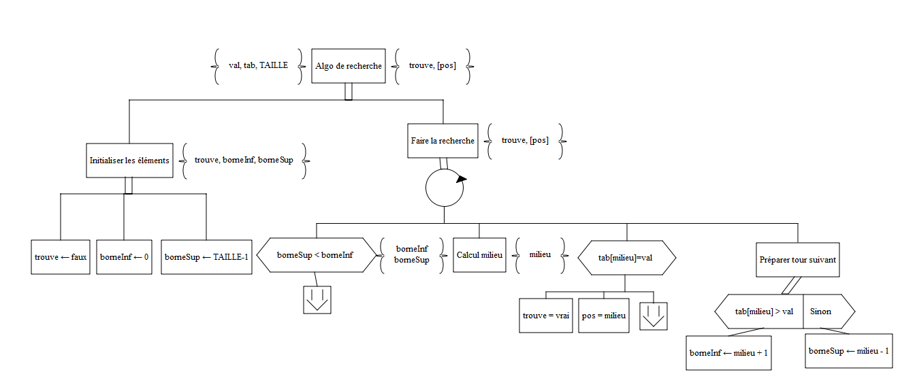

## R1.01 Initiation au devéloppement (Partie 2)

#### Exercice 1 -Rechercher une valeur dans un tableau ordonné d’entiers

##### Partie 1 - Déclaration et appel

1. *La position de val dans tab est-elle unique ? Dans ce cas, décrire cette position. Dans quel cas elle pourrait être unique ? Argumentez - Expliquez.*
-   Non elle n'est pas unique.
-   Si plusieurs valeurs sont égales dans tab la position retournée n'est pas unique.
-   Si le tableau est ordonné **strictement** croissant/décroissant

2. *Écrire la déclaration  C++ du sous-programme recherchePremiereOcc en respectant les noms qui vous ont déjà été fournis (nom du sous-programme et des éléments tab, lgTab et val).*
```cpp
void recherchePremiereOcc(const int tab[], unsigned int NB_CASES, int val, bool& trouve, unsigned int& pos);
// BUT : Affiche si l'élément (val) a été trouvé (trouve) dans le tableau
//       (tab[]) de longueur (NB_CASES) et si oui, la position (pos) de la valeur
//       à trouver
```
3. *Dans le sous-programme main() écrire l’appel de recherchePremiereOcc, en vue de rechercher le contenu de valCherchee  dans  un  tableau monTab  trié  par  ordre  décroissant  strict.  Compléter  le  code  avec les déclarations des éléments que vous jugez utiles, et l’action exploitant les résultats de l’appel.*
```cpp
int main () {
    // ELEMENTS DU PROGRAMME (constantes et variables)
    const unsigned int TAILLE = 10;
    int monTab [TAILLE] = {60, 45, 30, 25, 15, 10, 0, -15, -20, -45};
                        // trié strictement décroissant
    int valCherchee;    // valeur cherchée dans monTab
    bool estTrouve;     // Indique si la valeur est trouvée
    unsigned int position;      // La position de valCherchee dans tab

    // TRAITEMENTS
    /*Code*/
    // ... >> Initialisation valeur cherchee >> valCherchee
    cout << "Entrer une valeur à trouver : ";
    cin >> valCherchee;

    // tab, TAILLE, valCherchee, estTrouve, position  >> rech. 1ere occ. >> estTrouve, [position]
    recherchePremiereOcc(monTab, TAILLE, valCherchee, estTrouve, position);

    // valCherchee, estTrouve, [position]  >> exploiter résultat recherche >> (écran)
    if(estTrouve){
        cout << "La valeur " << valCherchee << " se trouve pour la première fois en position " << position+1 << " dans le tableau monTab." << endl;
    }
    else{
        cout << "La valeur " << valCherchee << " ne se trouve pas dans le tableau" << endl;
    }

    return 0;
}
```

##### Partie 2 - Stratégie de l’algorithme : basée sur le modèle du parcours dichotomique

**Condition d’application (pré-condition)**
La recherche dichotomique est applicable grâce aux 2 propriétés vérifiées par le tableau utilisé :
-   Structure à accès direct
-   Tableau trié

**Rappel du Principe**
-   Le  parcours  dichotomique  consiste  à  diviser  par  2,  à  chaque  itération,  la  portion  de  tableau  restant  à parcourir. Nous  appellerons  respectivement borneInf et borneSup  la  borne  inférieure  (respectivement  borne supérieure) de la portion de tableau restant à parcourir
-   A chaque itération, l’élément courant à analyser est celui situé au milieu de l’espace de recherche restant à parcourir. Cet indice du milieu est un entier calculé par la formule suivante : (borneInf + borneSup)/2, où la division est une division entière

**Travail à faire**

4. Pour  mieux  comprendre  le  principe  du  parcours  dichotomique,  reporter  sur  le  tableau  l’évolution  des éléments  de  l’algorithme  lors  de  la  recherche  dichotomique  de  la  valeur  3  dans  le  tableau  d’entiers  ci-dessous.

|  val |  borneInf | borneSup  | milieu  |
| :----:  | :----:  | :----:  | :----:  |
| 3 | 0 | 9 | 4 |
| 3 | 5 | 9 | 7 |
| 3 | 5 | 6 | 5 |
| 3 | 6 | 6 | 6 |
| 3 | 6 | 5 | 0 |

| 0 | 1 | 2 | 3 | 4 | 5 | 6 | 7 | 8 | 9 |
| :----:  | :----:  | :----:  | :----:  | :----:  | :----:  | :----:  | :----:  | :----:  | :----: |
| 60 | 45 | 30 | 25 | 15 | 10 | 0 | -15 | -20 | -45 |

5. Exprimer les conditions de fin d’itération à l’aide des éléments de l’algorithme

-   borneSup < borneInf
-   tab[milieu] == val

6. Écrire  l’algorithme  correspondant  à  cette  stratégie,  accompagné  des  spécifications  internes  succinctes nécessaires



```cpp
void recherchePremiereOccDichoEntier(const int tab[], unsigned int NB_CASES, int val, bool& trouve, unsigned int& pos)
{
    //VARIABLES
    unsigned short int borneInf;
    unsigned short int borneSup;
    unsigned int milieu;
    unsigned int compteur = 0 ;

    //Initialiser les éléments
    trouve = false;
    borneInf = 0;
    borneSup = NB_CASES - 1;

    //Faire la recherche
    while (borneSup >= borneInf)
    {
        //Calcul milieu
        milieu = ((borneInf + borneSup)/2);

        //Valeur trouvée
        if (tab[milieu]==val)
        {
            trouve = true;
            pos = milieu;
            compteur++;
            break;
        }
        compteur++;
        //Préparer tour suivant
        if (tab[milieu] > val)
        {   
            compteur++;
            borneInf = milieu + 1;
        }
        else
        {
            compteur++;
            borneSup = milieu - 1;
        }
    }
    cout << "Compteur d'acces = " << compteur << endl;
}
```

##### Partie 3 - Élaboration d’un jeu d’essai permettant de tester le programme et Calcul des performances de l’algorithme

7. Établir  le  jeu  d’essai  qui  vous  permettra  de  tester  et  valider le  bon  fonctionnement  de  l’algorithme  de recherche dichotomique. Il sera composé des tableaux que vous jugerez pertinents d’utiliser, et des valeurs recherchées pertinentes pour chaque tableau.
8. Sensibilisation à la notion de complexité : à faire en TP
    -   a) Compléter cet algorithme de sorte qu’il calcule (et affiche) le nombre de fois qu’une case du tableau sera accédée au cours de l’exécution de l’algorithme.
    ```cpp
    void recherchePremiereOccDichoEntier(const int tab[], unsigned int NB_CASES, int val, bool& trouve, unsigned int& pos)
    {
        //VARIABLES
        unsigned short int borneInf;
        unsigned short int borneSup;
        unsigned int milieu;
        unsigned int compteur = 0 ;

        //Initialiser les éléments
        trouve = false;
        borneInf = 0;
        borneSup = NB_CASES - 1;

        //Faire la recherche
        while (borneSup >= borneInf)
        {
            //Calcul milieu
            milieu = ((borneInf + borneSup)/2);

            //Valeur trouvée
            if (tab[milieu]==val)
            {
                trouve = true;
                pos = milieu;
                compteur++;
                break;
            }
            compteur++;
            //Préparer tour suivant
            if (tab[milieu] > val)
            {   
                compteur++;
                borneInf = milieu + 1;
            }
            else
            {
                compteur++;
                borneSup = milieu - 1;
            }
        }
        cout << "Compteur d'acces = " << compteur << endl;
    }
    ```
    -   b) Est-ce que ce nombre est toujours le même, quelle que soit la valeur cherchée ?
    **Non, il est différent.**
    -   c) Donner alors :  
    -   le nombre minimum d’accès nécessaires pour trouver un élément dans le tableau
    **Nombres d'accès minimum = 1 (pour un tableau de taille 10)**
    -   le nombre maximum d’accès nécessaires pour trouver l’élément dans le tableau. S’appuyer sur le  cours :  il  dit  que le  nombre  maximum  d’itérations  pour  aboutir à une zone de recherche contenant 1 seule case est ≤ log2(n), où n est la taille initiale du tableau.
    **Nombre d'accès maximum = 7 (pour un tableau de taille 10)**
    -   le nombre moyen d’accès nécessaires pour trouver un élément dans le tableau
    **Nombre d'accès moyen 4,8**
    
    d) Comparer ces valeurs avec les mêmes valeurs obtenues lorsque la recherche est séquentielle
    **Nombre d'accès minimum = 1**
    **Nombre d'accès maximum = 10**
    **Nombre d'accès moyen = 5,5**

***4,8 contre 5,5 accès en moyenne. La recherche de première occurence dichotomique est plus optimisée pour cette tâche.***

##### Partie 4 - Tableau d’enregistrements : à faire en TP
*Supposons maintenant que le tableau tab contient lgTab enregistrements décrivant des personnes, et que l’on souhaite lancer la recherche d’une personne par son nom.*

**Travail à faire**

9. Quelles  sont  les  pré-conditions  (conditions  sur  les  données  de l’algorithme)  pour  pouvoir  appliquer  la recherche de première occurrence développée à la question précédente ?
**Le nom des personnes doit être classé par ordre décroissant dans le tableau.**
10. En supposant toutes les conditions satisfaites, adapter l’algorithme à ce cas particulier de recherche.

#### Exercice 2 - Déterminer la première/dernière des occurrences dans un tableau ordonné d’entiers

**Travail à faire**
-   60  60  60  60  60  60  60  60  60  60
avec val = 60
**Premier = 1  Dernier = 10**
-   60  50  45  40  30  20  20  20  10  5
avec val = 20
**Premier = 6  Dernier = 8**
-   60  50  45  40  30  20  20  20  10  5
avec val = 5
**Premier = 10  Dernier = 10**
-   60  50  45  40  30  20  20  20  10  5
avec val = 14
**Premier = /  Dernier = /**

**Ecrire la déclaration du sous-programme**

```cpp
void determinerPremierDernierEntier(const int tab[], unsigned int NB_CASES, bool& trouve, int& val, unsigned int& premier, unsigned int& dernier);
```

**Compléter le main avec l'appel du sous-programme et les déclaration des éléments utiles au sous-programme**

```cpp
int main (void){
    // ELEMENTS DU PROGRAMME (constantes et variables)
    const unsigned short int TAILLE = 10;       // Taille du tableau monTab
    int monTab [TAILLE] = {60, 50, 45, 40, 30, 20, 20, 20, 10, 5};      // décroissant
    int valCherchee;    // valeur cherchée dans monTab
    bool estTrouve;     // determine si la valeur est présente dans le tableau au moins une fois
    unsigned int premier;       // La position de la premiere fois que la valeur apparaît
    unsigned int dernier;       // La position de la derniere fois que la valeur apparaît

    // TRAITEMENTS
    
    // ... >> Initialisation valeur cherchee >> valCherchee
    cout << "Entrer la valeur que vous cherchez : ";
    cin >> valCherchee;
    
    // monTab, TAILLE, estTouve, valCherchee, premier, dernier >> determinerPremierDernier  >> premier, dernier, valCherchee
    determinerPremierDernierEntier(monTab, TAILLE, estTrouve, valCherchee, premier, dernier);

    // valCherchee, premier, dernier  >> exploiter résultat >> (écran)
    if(trouve)
    {
        cout << "La premiere fois que " << val << " apparaît, c'est en position " << premier+1 << "." << endl;
        cout << "La dernière fois que " << val << " apparaît, c'est en position " << dernier+1 << "." << endl;
    }
    else
    {
        cout << "Le valeur " << val << " n'est pas présente dans le tableau." << endl;   
    }

    return 0;
} 
```


