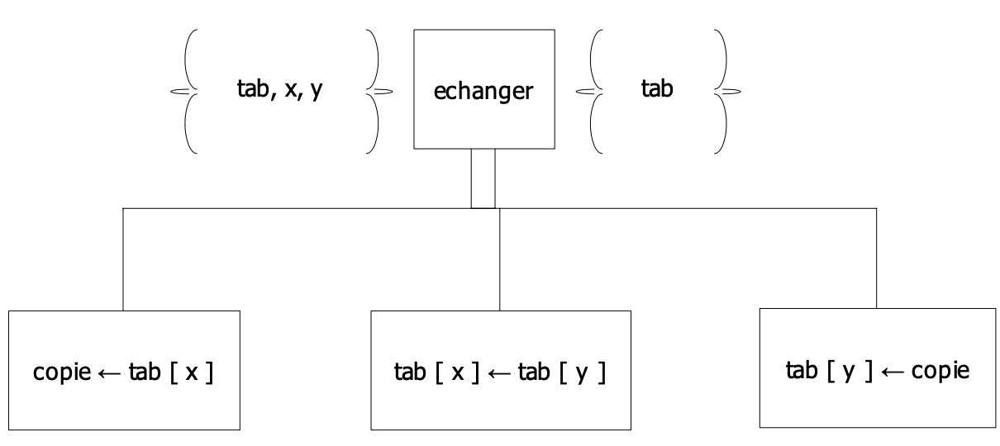

## R1.01 Initiation au devéloppement (Partie 2)

## Algorithmes classiques pour d’éléments homogènes :  Tris

## 1. Tri de la bulle
***Principe général :***
```cpp
/*
On choisit :
-   le sens de parcours, par exemple de gauche à droite.
-   le sens du tri, ici, le sujet dit croissant.

Lors du parcours, ici démarrant au premier indice de gauche, il s’agira de faire circuler l’extremum vers la droite du tableau.
-   Compte-tenu des choix réalisés, cet extremum est le plus grand élément. On fait donc circuler le plus grand
élément en comparant 2 à 2 les éléments du tableau, et en les échangeant si l’élément de gauche est plus grand que l’élément de droite.
-   Durant ce parcours, l’élément le plus à gauche sera comparé avec son premier voisin de droite, et déplacé vers la droite par échanges
successifs, jusqu'à ce qu'il rencontre un élément plus grand
et ainsi de suite jusqu'à ce que la dernière place du tableau soit occupée par l’élément le plus grand du tableau.
-   A la fin de ce parcours, la place la plus à droite sera occupée par le plus grand élément du tableau.

Il faut alors recommencer un nouveau parcours, depuis la case la plus à gauche, mais cette fois, l’élément le plus
grand rencontré lors du parcours sera placé à l’avant-dernière case du tableau.

Un nouveau parcours permettra alors de faire circuler le plus grand élément du parcours
à l’avant-avant-dernière case du tableau.

A chaque itération (nouveau parcours), la portion de tableau parcourue diminue.

Lors de la dernière itération, la portion de tableau parcourue aura 2 cases. A la fin de ce dernier parcours, le tableau sera complètement trié.*/
```

### A.- Mise en œuvre de l’Algorithme du tri Bulle 
### Partie 1 : *Faire monter la bulle vers la dernière case de la portion de tableau non triée*
```cpp
/* -------------------------------------------------------------------------- */
/*                                 DECLARATION                                */
/* -------------------------------------------------------------------------- */
void triBulle ( int tab [], unsigned int nbTab);
// tri CROISSANT des nbTab (>0) éléments de tab (avec d’éventuels doublons)
// par la méthode de tri de même nom

/* -------------------------------------------------------------------------- */
/*                                 DEFINITION                                 */
/* -------------------------------------------------------------------------- */
void triBulle(int tab[], unsigned int nbTab)
{
    /* -------------------------------------------------------------------------- */
    /*                                  VARIABLES                                 */
    /* -------------------------------------------------------------------------- */
    unsigned int ici; // Emplacement auquel la valeur doit être traitée
    /* -------------------------------------------------------------------------- */
    /*                                 TRAITEMENTS                                */
    /* -------------------------------------------------------------------------- */

    /* --------------- Si le tableau contient au minimum 1 valeur --------------- */
    if (nbTab > 0)
    {
        for (ici = nbTab-1 ; ici >= 1; ici--)
        {
            faireMonterLaBulleIci(tab, 0, ici);
        }
    }
}
```
**Principe**
```cpp
/*Stratégie basée sur le parcours complet (de la zone triée) avec traitement conditionné
Traitement répété et soumis à condition : Echanger(tab[i] & tab[i+1]
Condition : tab[i] > tab[i+1] */
```

#### Travail à faire
1. ***Écrire en C++ la déclaration du sous-programme (fonction ? procédure ?) faireMonterLaBulleIci mettant en œuvre cette stratégie.***
```cpp
/* -------------------------------------------------------------------------- */
/*                                 DECLARATION                                */
/* -------------------------------------------------------------------------- */
void faireMonterLaBulleIci (int tab[], unsigned int bDeb, unsigned int& ici);
// BUT : Ajoute le plus grand élément de la partie encore
//       non triée dans la partie triée en l'ajoutant à la
//       place ici.

/* -------------------------------------------------------------------------- */
/*                                 DEFINITION                                 */
/* -------------------------------------------------------------------------- */
void faireMonterLaBulleIci(int tab[], unsigned int bDeb, unsigned int& ici)
{
    /* -------------------------------------------------------------------------- */
    /*                                  VARIABLES                                 */
    /* -------------------------------------------------------------------------- */
    int copieTab; // La copie du nombre contenu dans tab[i] pour effectuer l'échange
    /* -------------------------------------------------------------------------- */
    /*                                 TRAITEMENTS                                */
    /* -------------------------------------------------------------------------- */
    for (unsigned int i = bDeb; i <= ici-1; i++)
    {
        if (tab[i] > tab[i+1])
        {
            copieTab = tab[i];
            tab[i] = tab[i+1];
            tab[i+1] = copieTab;
        }
    }
}
```

2. ***Écrire l’algorithme du sous-programme.***


### Partie 2 : *Trier tout le tableau*

#### Travail à faire
3. ***A partir de la situation décrite à l’étape 1, que faut-il faire pour trier le tableau tab ?***
Il faut faire une boucle partant de nbTab jusqu'à 1 qui  effectue FaireMonterLaBulleIci & ici doit être décrémenté à chaque tour.
4. ***Écrire l’algorithme du triBulle en respectant la déclaration fournie dans l’encadré. Accompagner l’algorithme des spécifications internes appropriées.*** 


##### *Il faut que le nombre de cases du tableaux soit strictement supérieur à 0 (ou supérieur ou égal à 1).*

### B.- Comparaison des performances du tri Bulle et du tri par sélection de Place
*(sensibilisation à la complexité temporelle)*
*Les 2 algorithmes ont été développés en utilisant la même technique :
-   **a.** On considère la portion de tableau tab(0..ici) non encore triée, la portion tab(ici+1..nbTab-1) déjà triée
-   **b.** On écrit l’algorithme nécessaire à placer en position ici le plus grand élément de la portion tab(0..ici)
-   **c.** On généralise l’algorithme de **l’étape b.** pour trier tout le tableau On va comparer les performances des algorithmes réalisés à **l’étape b.** pour chacun des tris vus : tri par sélection de Place et tri de la Bulle*

#### Travail à faire
5. ***Calculer :***
-   le nombre de comparaisons, et le nombre correspondant d’accès au tableau 
-   le nombre d’échanges dans le tableau, et le nombre correspondant d’accès au tableau dans les actions : faireMonterLaBulleIci (bDeb..ici) et placerLaPlusGrandeValeurDeTab(bDeb..ici)EnPositionIciavec bDeb = 0

#### -   Pour le triBulle :
-   **Nombre de comparaisons :** nbTab - 1 + nbTab - 2 + ... + nbTab - nbTab
    **Nombre d'accès au tableau** de 0 à 3 x nbTab x nbTab
#### -   Pour le tri par sélection de place :
-   **Nombre de comparaisons :** nbTab - 1 + nbTab - 2 + ... + nbTab - nbTab + nbTab
    **Nombre d'accès au tableau** //

6. ***Quelle(s) conclusions peut-on en tirer ?***
Le nombre de comparaison est identique mais le nombre d'accès au tableau est plus faible pour le tri par sélection de place, le modèle est donc à privilégier.

### C.- Généralisation à des tableaux d’informations complexes
*On  suppose  maintenant  que  le  tableau  ne  contient  pas  que  des  entiers,  mais  des  informations  complexes. Considérons par exemple une collection de personnes regroupées dans un agenda. Pour ce faire, deux types Adresse et Personne ont été définis.*
```cpp
// Type Personne
struct Personne {
        string nom;
        string prenom;
        Adresse adresse;
};

//Type Adresse
struct Adresse  {
    string numRue;
    string nomRue;
    unsigned short int codePostal;
    string nomVille;
};
```
#### Travail à faire
7. ***Faire les modifications qui s’imposent au niveau des algorithmesFaireMonterLaBulleIci et triBulle pour trier un agenda, implémenté sous la forme d’un tableau tab de UnePersonne, par ordre alphabétique croissant sur les noms des personnes.***


```cpp
/* -------------------------------------------------------------------------- */
/*                                 DECLARATION                                */
/* -------------------------------------------------------------------------- */
void faireMonterLaBulleIci(Personne tab[], unsigned int bDeb, unsigned int& ici);


/* -------------------------------------------------------------------------- */
/*                                 DEFINITION                                 */
/* -------------------------------------------------------------------------- */
void faireMonterLaBulleIci(Personne tab[], unsigned int bDeb, unsigned int& ici)
{
    /* -------------------------------------------------------------------------- */
    /*                                  VARIABLES                                 */
    /* -------------------------------------------------------------------------- */
    Personne copieTab; // La copie de la personne pour effectuer l'échange

    /* -------------------------------------------------------------------------- */
    /*                                 TRAITEMENTS                                */
    /* -------------------------------------------------------------------------- */
    for (unsigned int i = bDeb; i <= ici-1; i++)
    {
        if (tab[i].nom > tab[i+1].nom)
        {
            copieTab = tab[i];
            tab[i] = tab[i+1];
            tab[i+1] = copieTab;
        }
    }
}
```
8. ***Est-ce que les calculs de performance précédemment calculés ont changé ?***
Les accès aux tableau ne seront pas pareil.

## 2.- Tri par insertion (ou Tri par sélection de valeur)

```cpp
void triParInsertion ( int tab [], unsigned int nbTab);
// tri CROISSANT des nbTab (>0) éléments de tab (avec d’éventuels doublons)
// par la méthode de tri de même nom
```

**Principe**
```cpp
/*On ajoute un par un de nouveaux éléments à un tableau
déjà trié en les insérant « à sa place », c’est-à-dire à
une place telle que le nouveau tableau soit aussi trié.*/
```
**Stratégie de mise en œuvre de l’algorithme**
*On applique la méthodologie de décomposition du problème vue dans les tris précédents. On définit la situation (‘=’photo’) du tableau en cours de tri (Partie 1), situation qui est amenée à être répétée (Partie 2)*

### Partie 1 : *Insérer tab[ici] à sa place dans la portion de tableau tab(bDeb..ici)*

**Procédure Insertion**
```cpp
/* -------------------------------------------------------------------------- */
/*                                 DECLARATION                                */
/* -------------------------------------------------------------------------- */
void insertion(int tab [], unsigned int bDeb, unsigned int ici);
// étant donnée une portion de tableau tab(bDeb..ici),
// telle que tab(bDeb..ici -1) est triée par ordre croissant de valeurs, 
// trouve l’indice saPlace du tableau tab compris entre deb et ici, auquel la
// valeur tab[ici] devra être insérée pour que la portion tab(bDeb..ici) du
// tableau soit encore triée par ordre croissant
```

#### Travail à faire
1. **Écrire l’algorithme du sous-programme insertion, accompagné des spécifications internes succinctes nécessaires (nom, signification et type de chaque élément utilisé.**


```cpp
/* -------------------------------------------------------------------------- */
/*                                 DEFINITION                                 */
/* -------------------------------------------------------------------------- */
void insertion(int tab [], unsigned int bDeb, unsigned int ici)
{
    /* -------------------------------- VARIABLES ------------------------------- */
    unsigned int j;
    int copieTab;
    /* ------------------------------- TRAITEMENTS ------------------------------ */
    copieTab = tab[ici];
    for (j = ici; j > 0 && tab[j - 1] > copieTab; j--)
    {
        tab[j] = tab[j - 1];
    }
    tab[j] = copieTab;
}
```
| Nom | Type | Signification |
| :----:  | :----:  | :----:  |
| j | entier non signé | indice du parcours du tableau  |
| copieTab | entier | Sauvegarde de l'élément contenu dans l'indice "ici" actuel |
| tab | tableau d'entiers | Le tableau d'entiers à traiter |
| bDeb | entier non signé | La borne de début du parcours |
| ici | entier non signé | La position à laquelle l'élément doit être placé|

### Partie 2 : *Trier tout le tableau*
*Il s’agit d’écrire l’algorithme de tri par insertion en s’appuyant sur le précédent sous-programme.*

#### Travail à faire
2. **Écrire l’algorithme du sous-programme triParInsertion, accompagné de spécifications internes succinctes nécessaires (nom, signification et type de chaque élément utilisé).**


```cpp
/* -------------------------------------------------------------------------- */
/*                                 DECLARATION                                */
/* -------------------------------------------------------------------------- */
void triParInsertion(int tab[], unsigned int NB_CASES);
// BUT : 

/* -------------------------------------------------------------------------- */
/*                                 DEFINITION                                 */
/* -------------------------------------------------------------------------- */
void triParInsertion(int tab[], unsigned int nbTab)
{
    /* -------------------------------- VARIABLES ------------------------------- */
    unsigned int ici;
    /* ------------------------------- TRAITEMENTS ------------------------------ */
    if (nbTab > 0)
    {
        for (ici = 1; ici <= nbTab-1; ici++)
        {
            insertion(tab, 1, ici);
        }
    }
}
```
#### *Le nombre de cases du tableau doit être strictement supérieur à 0 (ou inférieur ou égal à 1).*
| Nom | Type | Signification |
| :----:  | :----:  | :----:  |
| tab | tableau d'entiers | Le tableau d'entiers à traiter |
| nbTab | entier non signé | Le nombre de cases du tableau tab |
| ici | entier non signé | La position à laquelle l'élément doit être placé|


## 3.- Tri par sélection de place *(vu en cours)*

```cpp
/* -------------------------------------------------------------------------- */
/*                                 DECLARATION                                */
/* -------------------------------------------------------------------------- */
void triParSelectionDePlace ( int tab [], unsigned int nbTab);
// tri CROISSANT des nbTab (>0) éléments de tab (avec d’éventuels doublons)
// par la méthode de tri de même nom
/* -------------------------------------------------------------------------- */
/*                                 DEFINITION                                 */
/* -------------------------------------------------------------------------- */
void triParSelectionDePlace (int tab[], unsigned int NB_CASES)
{
    /* -------------------------------- VARIABLES ------------------------------- */
    unsigned int ici;
    unsigned int posMax;
    /* ------------------------------- TRAITEMENTS ------------------------------ */
    if (NB_CASES > 0)
    {
        for(ici=NB_CASES-1; ici >= 1; ici--)
        {
            posMax = positionDuMax(tab, 0, ici);
            echanger(tab, posMax, ici);
        }
    }
}
```

**Principe**
```cpp
/*Etant donnée une place (ici dans la démonstration),on
cherche l’élément du tableau (sa position) devant être
placé à l’endroit ici; puis on l’y place.*/
```

**Sous-programmes utiles**

```cpp
/* -------------------------------------------------------------------------- */
/*                                 DECLARATION                                */
/* -------------------------------------------------------------------------- */
unsigned int positionDuMax(const int tab[], unsigned int bDeb, unsigned int bFin);
//retourne l'indice de la plus grande valeur du tableau tab
//comprise entre les bornes bDeb et bFin

/* -------------------------------------------------------------------------- */
/*                                 DEFINITION                                 */
/* -------------------------------------------------------------------------- */
unsigned int positionDuMax(const int tab[], unsigned int bDeb, unsigned int bFin)
{
    /* -------------------------------- VARIABLES ------------------------------- */
    unsigned int posMax;
    /* ------------------------------- TRAITEMENTS ------------------------------ */
    posMax = bDeb;
    for(int i=bDeb; i<= bFin; i++)
    {
        if(tab[posMax] < tab[i])
        {
            posMax = i;
        }
    }
    return posMax;
}
```

```cpp
/* -------------------------------------------------------------------------- */
/*                                 DECLARATION                                */
/* -------------------------------------------------------------------------- */
void echanger(int tab[], unsigned int& x, unsigned int& y);
// echange le contenu de deux entiers x et y

/* -------------------------------------------------------------------------- */
/*                                 DEFINITION                                 */
/* -------------------------------------------------------------------------- */
void echanger(int tab[], unsigned int& x, unsigned int&y)
{
    /* -------------------------------- VARIABLES ------------------------------- */
    int copie;
    /* ------------------------------- TRAITEMENTS ------------------------------ */
    copie = tab[x];
    tab[x] = tab[y];
    tab[y] = copie;
}
```