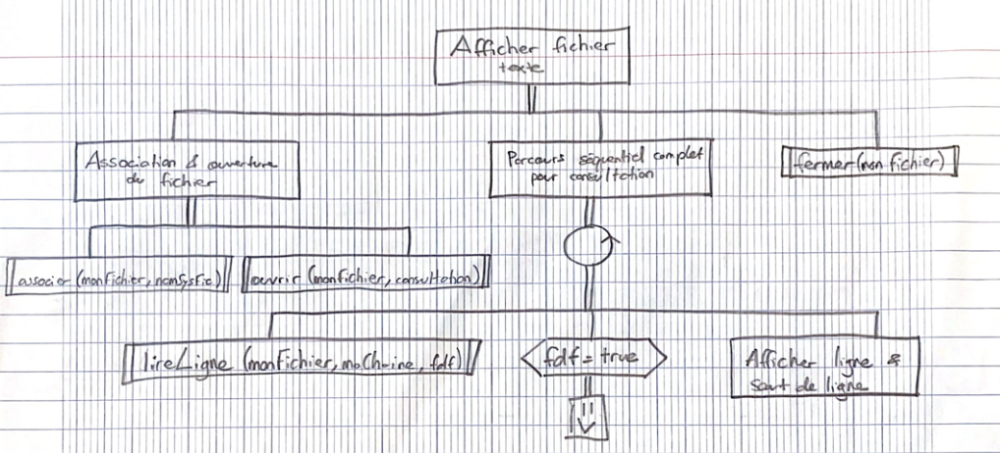
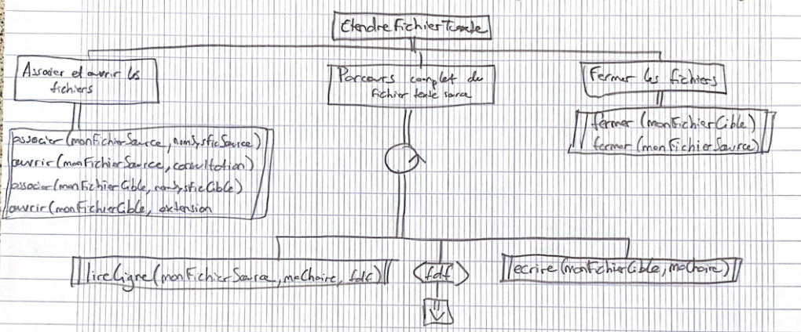
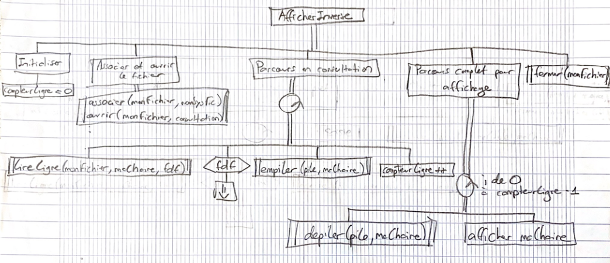
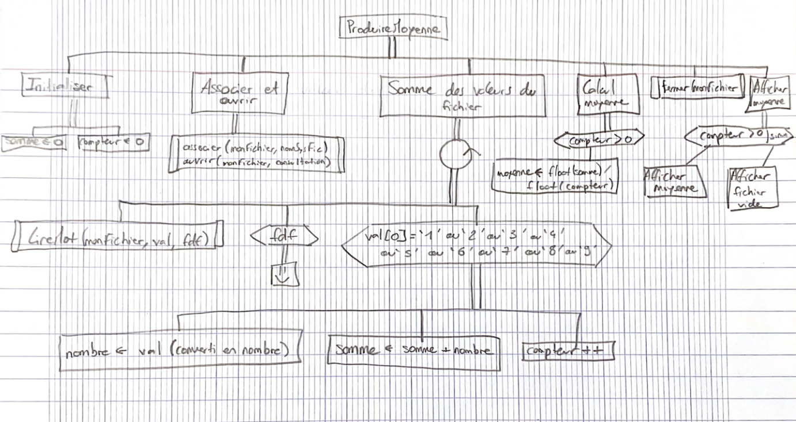
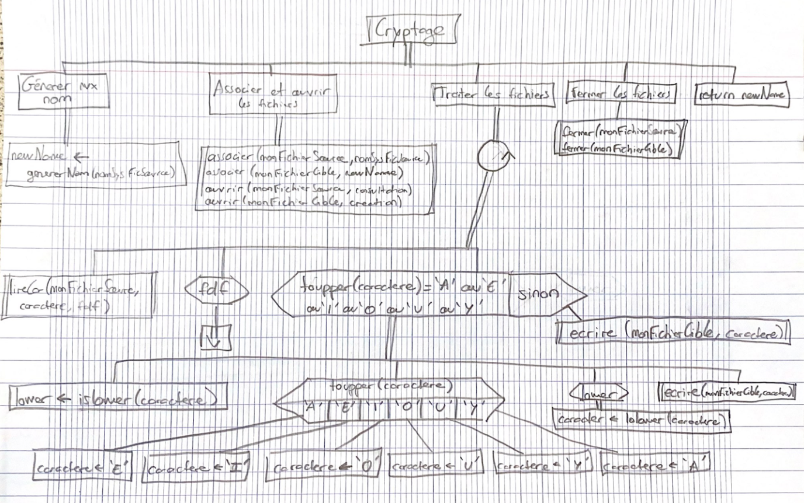
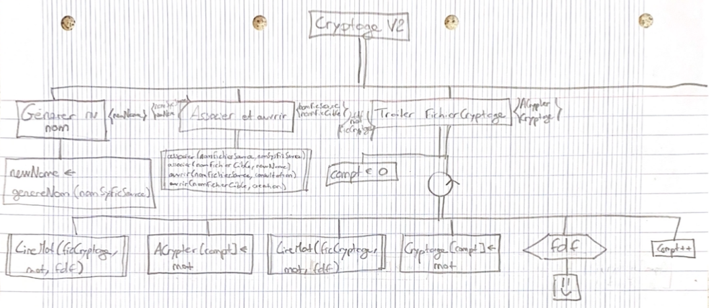
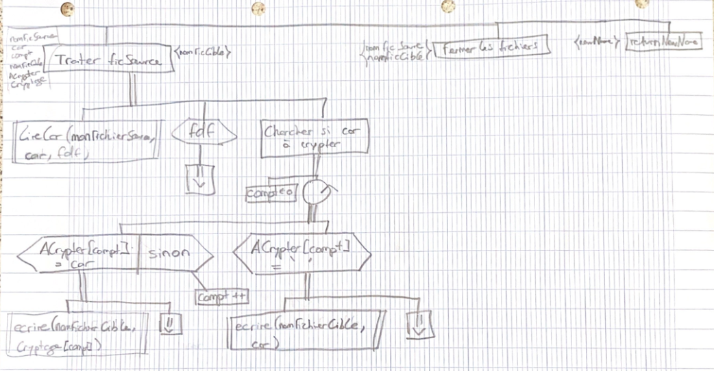

### R1.01 Initiation au développement

#### TD7 - Fichiers texte (= Fichiers éditables) avec contenus simples

#### 1.- Algorithmes sur un fichier (de lignes) de texte
 
**Travail à faire**
Pour chacun des sous-programmes : 

###### afficherFichierTexte
1. **Écrire la déclaration du sous-programme (entête + BUT !)**
```cpp
void afficherFichierTexte (string nomSysFic);
// BUT : Affiche à l'écran le contenu d'un
//       fichier de texte de nom systeme nomFic.
```
2. **Identifier le modèle d’algorithme vu en cours permettant de réaliser le but donné. Préciser la stratégie.**
<span style="color:darkCyan;" >Parcours complet avec traitement systématique</span>

3. **Écrire l’algorithme réalisant le but donné.**


###### etendreFichierTexte
1. **Écrire la déclaration du sous-programme (entête + BUT !)**
```cpp
void etendreFichierTexte(string nomSysFicSource, string nomSysFicCible);
// BUT :  transfère le contenu d'un fichier de texte nomSysFicSource
//        en fin d'un autre fichier de texte nomSysFicCible.
//        Les fichiers sont identifiés par leurs nom système.
```
2. **Identifier le modèle d’algorithme vu en cours permettant de réaliser le but donné. Préciser la stratégie.**
<span style="color:darkCyan;" >Parcours complet avec traitement conditionné</span>

3. **Écrire l’algorithme réalisant le but donné.**


###### afficherInverseFichierTexte
1. **Écrire la déclaration du sous-programme (entête + BUT !)**
```cpp
void afficherInverseFichierTexte(string nomSysFic);
// BUT : affiche à l'écran le contenu d'un fichier
//       de texte de nom systeme nomFic.
//       L'affichage est à l'envers, cad :
//       dernière ligne du fichier texte --> 1ere ligne écran
//       ...
//       1ère ligne du fichier texte --> derniere ligne de l'écran
```
2. **Identifier le modèle d’algorithme vu en cours permettant de réaliser le but donné. Préciser la stratégie.**
<span style="color:darkCyan;" >Parcours complet avec traitement systématique</span>

3. **Écrire l’algorithme réalisant le but donné.**

 
#### 2.- Fichier de nombres éditable : Calcul de moyennes pluviométriques

**Travail à faire**
1. **Écrire la déclaration du sous-programme**
```cpp
void produireMoyenne(string nomSysteme);
// BUT : Calculer la moyenne des valeurs pluviométriques contenues
//      dans le fichier de nom système nomSysteme.
// Pré-cond : Fichier non vide
```

2. **Identifier le modèle d’algorithme vu en cours permettant de réaliser le but donné. Préciser la stratégie.**
<span style="color:darkCyan;" >Parcours complet avec traitement conditionné</span>

3. **Écrire l’algorithme réalisant le but donné.**


#### 3.- Fichier de caractères  : Cryptage

##### A. Version simple

**Travail à faire**
1. **Écrire la déclaration du sous-programme cryptage.**
```cpp
#include <iostream>
string cryptage (string nomSysFicSource);
```
2. **Identifier le modèle d’algorithme vu en cours permettant de réaliser le but donné. Préciser la stratégie.**
<span style="color:darkCyan;" >Parcours complet avec traitement conditionné</span>
3. **Écrire l’algorithme réalisant le but donné.**


4. **Écrire la déclaration du sous-programme chargé de générer le nouveau nom système à partir de celui qui lui est fourni.**
```cpp
string genererNom (string nomFichier);
```

##### B. Version étendue

**Travail à faire**
1. **Écrire la déclaration du sous-programme cryptage.**
```cpp
string cryptage (string nomSysFicSource, string nomSysFicCodes);
```
2. **Identifier le modèle d’algorithme vu en cours permettant de réaliser le but donné.**
<span style="color:darkCyan;" >Parcours complet avec traitement conditionné</span>

3. **Écrire l’algorithme réalisant le but donné.**

