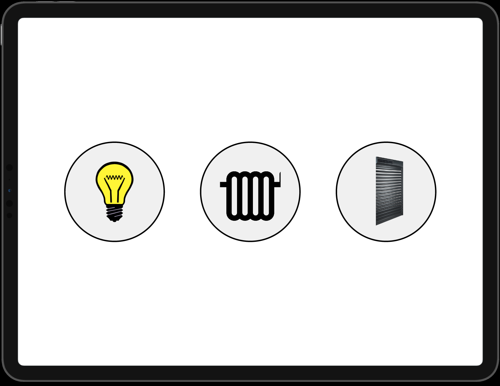

# TP3

### Wireframe : un écran minimum

#### Ecran contenant le scénario principal et le scénario alternatif du TP2

##### Scénario principal :

##### Scénario alternatif :

#### Charte graphique

##### Jeu de couleurs

Palette de couleur utilisé pour notre application

##### Zoning des écrans principaux

Gestion de l'espace de l'écran

##### Elements communs des différents écrans

Les éléments communs aux écrans

