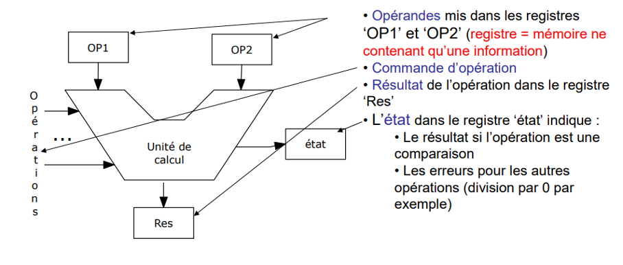

# R1.03 Architecture des ordinateurs

Ordinateur = machine de traitement automatique d’informations
Machine -> technologie (électronique, mécanique…) 
Traitement -> opérations
Automatique -> autonome
Information -> connaissance sur quelque chose ou quelqu’un

Information = valeur et domaine (ça dit quoi sur quoi)

Le domaine est infini -> on ne peut pas le représenter
-> Perte du sens (sur quoi)

Machine (objet fini) -> impossible de lui faire traiter des infos à nombre de valeurs infini.
Continu -> se limiter avec des valeurs finies (précision) -> perte de qualité

On accepte de perdre beaucoup :
	Pas de représentation du domaine (sémantique)
	Discrétisation du continu (qualité)

Shannon : entropie de l’information (mesure de l’information)
Qt d’information proportionnel à la probabilité de trouver la réponse par hasard.
Le bit -> qt minimum d’information (2 choix 0 ou 1)
Si on pose une question avec 1 seule réponse possible -> Qt d’information 0
S’il y a 2 réponses possibles -> Qt d’information minimale

Toute info à valeur finies peut être reconstitués à partir d’infos de quantité moindre (à la limite de mesure minimale)

### Représentation de l’information

Par langage :
	Alphabet = ensemble fini de symboles
	Constitution de mots (concaténation de symboles, superposition)
	Format des mots (fixe ou variable)
	Taille des mots (taille ou taille max)
	Règles syntaxiques (facultatives  mots interdits)

Alphabet de k symboles
	Format fixe taille n -> on a kn mots possibles
	Format variable taille max n -> on a (kn+1-k)/(k-1) mots possibles
Assignation sémantique
	Toute info a 1 (ou plusieurs) mot(s) associé(s).
	Un mot peut représenter 0 ou 1 info (pas d’ambiguïté).

### Traitement d’information

Traitement d’informations « à la main »
Informations données du problème
Informations résultats
Le traitement consiste à passer des données du problème au résultat par une méthode quelconque (comme on peut)

### Traitement par une machine
Codage : on représente les données du problème dans un langage compréhensible par la machine (par exemple en binaire)
Traitement automatique : la machine effectue les traitements qui produisent les résultats dans le même type de représentation. Il faut donc que la méthode soit connue.
Décodage : il suffit de décoder ces informations pour les présenter sous une forme compréhensible par l’utilisateur (texte, image…)

### Choix de la représentation

Langage : binaire pour des raisons techniques (pas obligatoire)
Assignation sémantique : associer un mot du langage à chaque information (arbitraire)
Non ambiguïté : un mot ne peut pas désigner plusieurs informations
Choix de l’assignation sémantique arbitraire mais il vaut mieux choisir une assignation qui facilite les traitements
Représentation des caractères : 
-	Codes standards respectant l’ordre alphabétique (UTF)

Représentation des nombres : 
-	Faciliter les opérations arithmétiques, mathématiques,…

Représentation des autres informations :
-	Au coup par coup (vous aurez à le faire)
-	Parfois plusieurs représentations selon les opérations (ex : couleurs)

### Les nombres

Entiers naturels :
-	En base 2 : N s’écrit an-1 an-2 … a1 a0 avec ai qui vaut 0 ou 1 et N vaut : an-1 * 2n-1 + an-2 *2n-2 + … a1 * 2 + a0
-	Les opérations classiques fonctionnent bien
#### Entiers relatifs :
-	Le principe est d’utiliser la moitié des mots possibles (sur n bits on a 2n mots possibles) pour les positifs et l’autre moitié pour les négatifs
-	On cherche une représentation dans laquelle la somme d’un nombre et de son opposé donne 0 (ou plutôt donne 2n car si on utilise n bits 2n s’écrit 0 car ça déborde)
-	Représentation en complément à 2 :
	-	Un nombre positif est représenté comme un entier naturel mais le premier bit doit être 0 (première moitié)
	-	Un nombre négatif N est représenté comme l’entier naturel 2n + N (seconde moitié)
	Les opérations classiques fonctionnent bien
#### Réels
-	Notation scientifique (mantisse et exposant)  2 entiers relatifs
-	Mais les opérations ne sont pas simples

### Ordinateur

	But : concevoir une machine automatique de traitement d’informations

-	Théorie : machine de Turing = machine théorique qui peut calculer de façon autonome tout ce qui est calculable (mais tout n’est pas calculable - Gödel)
-	Il suffit de concevoir une machine qui peut se substituer à une machine de Turing
-	Elle doit donc savoir-faire au moins l’équivalent de ce que fait la machine de Turing (mais elle peut savoir faire plus).
-	On n’évitera pas les limites dues au matériel (coût, fiabilité, tailles limités, temps de traitement, …)
-	On cherchera à les minimiser
-	Von Neumann propose une architecture simple qui est équivalente à la machine de Turing  le problème est résolu
-	La technologie actuelle est l’électronique mais ce n’est pas obligatoire

### Architecture de Von Neumann

#### Unité de traitement

-	Rôle : effectuer les opérations sur les informations
-	Machine de Turing :
	-	Peut calculer tout ce qui est calculable
	-	Les opérations qu’elle sait faire sont donc suffisantes pour un ordinateur
	-	Il suffit que l’unité de traitement sache faire au moins l’équivalent de ces opérations là (il y en a très peu)
	-	En général l’unité de traitement sait en faire beaucoup plus pour être plus efficace et plus rapide

-	L’assignation sémantique est choisie pour faciliter les opérations :
	-	Entiers naturels en base 2
	-	Entiers relatifs en complément à 2
	-	Réels en notation scientifique (mantisse + exposant)
	-	Caractères dans l’ordre alphabétique
	… 
-	Opérations implémentées :
	-	Arithmétiques (+ - * /)
	-	Logiques (ET OU NON OU Exclusif) 
	-	Décalages (Logiques, arithmétiques et cycliques)
	-	Comparaison (=  <  > ≥)
	-	Mathématiques (sin, log, …)
	-	Vectorielles (+ - * / …)
	…

*Les opérandes respectent une assignation sémantique adaptée aux opérations*.

### Mémoire

-	Cahier des charges :
	-	On doit pouvoir y stocker des informations
	-	Elle doit les conserver
	-	On doit pouvoir les retrouver
-	Quelles informations ?
	-	Toutes celles manipulées par l’ordinateur (données du problème, résultats intermédiaires, résultats finaux)

-	Les informations sont représentées par des langages binaires (déjà vu)
-	On utilise le format fixe parce que c’est plus simple et que le matériel n’
-	Les informations sont donc toutes des mots binaires de N bits
-	La taille N de ces mots binaires peut être quelconque actuellement on utilise le plus souvent 64 bits. 264 ≈ 18 1018 (18 milliards de milliards) c’est le plus souvent largement suffisant pour les utilisations courantes des ordinateurs
-	Lorsque ça ne suffit pas on peut toujours représenter une information sur k fois N bits en la découpant en plusieurs mots mais le traitement sera plus long puisqu’il faudra le faire par parties
-	*Remarque : 266 bits permettent de représenter plus d’informations qu’il n’y a de particules dans l’univers connu (estimé à 1080)*

-	Il faut pouvoir retrouver les informations stockées
-	Solutions :
	-	Balayer les K informations pour trouver la bonne mais comment savoir quelle est la bonne ?
	-	Savoir où elle est parmi les K informations stockées (adresse)
-	La première solution est possible (mémoire associative) on cherche une information à partir d’un modèle (par exemple une information qui commence par 0110 et qui finit par 0000) c’est utilisé dans des cas très particuliers
-	La seconde est plus simple et plus rapide (mémoire adressable) : c’est celle qui a été retenue

Mémoire adressable

-	Chaque information stockée a une adresse qui correspond à sa position dans la zone de stockage
-	Cette adresse est exprimée dans un langage binaire (comme toute information) • On choisit le format fixe parce que c’est du matériel
-	On doit avoir K adresses différentes donc il faut utiliser un langage binaire en format fixe de taille t tel que : 2t ≥ K
-	La taille des adresses dépend donc du nombre d’informations que la mémoire peut stocker et pas de la taille de ces informations
-	Par exemple si la mémoire peut stocker 1000 informations la taille des adresses est 10 (210 ≥ 1000)
-	En général on fabrique des mémoires dont le nombre d’informations est une puissance de 2 pour que toutes les adresses possibles soient utilisées :
	-	K (kilo) = 210 ≈ 1000
	-	M (méga) = 220 ≈ 1 million
	-	G (giga) = 230 ≈ 1 milliard (ordre de grandeur pour les mémoires d’ordinateur)
	-	T (téra) = 240 ≈ 1000 milliards (ordre de grandeur pour les disques)

-	Il faut pouvoir maintenant :
	-	Déposer des informations dans la mémoire (écrire)
	-	Récupérer des informations dans la mémoire (lire)
-	On a donc besoin :
	-	D’un registre où mettre les informations à écrire
	-	D’un registre où récupérer les informations lues
	-	De commandes pour lire et écrire 
-	*Remarque le registre où mettre les informations à écrire peut-être le même que celui où récupérer les informations lues puisqu’on ne fait jamais les 2 opérations en même temps*.

### Fonctionnement de la mémoire

#### Conséquences de ce fonctionnement

-	Chaque information doit être désignée par une adresse unique
	-	Nom de variable (toute variable doit avoir un nom)
	-	A ce nom (adresse) est associé une information (contenu)
-	Quand on lit une information on récupère une copie (l’original est toujours dans la zone de stockage)
-	Quand on utilise le contenu d’une variable sa valeur n’est pas perdue (l’affectation a ← x ne modifie pas x)
-	Quand on stocke une information à une adresse celle qui était avant à cette adresse est remplacée
-	Quand on modifie le contenu d’une variable son ancienne valeur est perdue (l’affectation a ← x perd l’ancienne valeur de a)

#### Caractéristiques d’une mémoire

-	Capacité
	-	Nombre d’informations qu’elle peut contenir (K) et taille de ces informations (N)
	-	L’habitude veut qu’on la mesure en octets (mot de 8 bits) plutôt qu’en bits. C’est donc K*N/8
-	Exemple :
	-	Une mémoire qui contient 230 (1 Giga) informations de 64 bits aura une capacité de 8 Giga octets (1 Giga informations de 8 octets chacune)
	-	Sur un PC une mémoire de 8 Go ne contient qu’1G informations

-	Opérations possibles
	-	Mémoires ne pouvant être que lues (ROM = Read Only Memory) les informations sont stockées à la construction de la mémoire
	-	Mémoire ne pouvant être que lues mais pouvant écrites une seule fois (PROM = Programmable Read Only Memory) les informations sont stockées une seule fois par un dispositif spécial (programmateur de PROM)
	-	Mémoire ne pouvant être que lues mais pouvant écrites plusieurs fois après effacement (EPROM = Erasable Programmable Read Only Memory ou EEPROM = Electrically Erasable Programmable Read Only Memory ou Flash) les informations sont stockées par un dispositif spécial mais on peut les effacer (totalement ou par parties) et recommencer (clés USB ou cartes SD par exemple)
	-	Mémoires pouvant être lues et écrites autant de fois qu’on veut (RAM = Random Access Memory) : celles que l’on trouve dans les ordinateurs

-	Conservation des informations (volatilité)
Combien de temps les informations mises dans la mémoire y sont-elles conservées ?
	-	**Toujours**
	-	Mémoires de type ROM ou PROM (non effaçables)
	-	Mémoires de type Flash (clés USB, cartes SD … effaçables)
	-	Mémoires de type EPROM ou EEPROM (effaçables)
	-	Tant que la mémoire est sous tension : mémoires de type RAM
	-	Très peu de temps (quelques ms) : mémoires de type DRAM qui doivent être réécrites à intervalles réguliers (celles que l’on a dans nos ordinateurs)

-	Vitesse (temps d’accès) 
Ou a vu que les opérations de lecture et d’écriture comportaient 2 étapes effectuées par la mémoire. Par exemple lors d’une lecture :
	-	Le décodeur d’adresses associe l’adresse à la position de l’information
	-	La mémoire copie l’information dans RM 
	-	Ces opérations prennent du temps
	-	La première opération est bien plus longue que la seconde
	-	On peut aller plus vite si on accède à des informations se trouvant à des adresses consécutives (on ne fait la première opération que pour le premier accès, pour les suivants le décodeur d’adresses se contente de sélectionner l’information suivante sans devoir réassocier l’adresse à la position)

-	Prix
	-	Le prix dépend bien entendu de la capacité 
	-	Mais il dépend aussi beaucoup de la technologie utilisée et en particulier de la vitesse 
	-	Par exemple une mémoire de PC de 8 Go peut coûter entre 30 € et 120 € selon sa vitesse (et la vitesse est loin d’être multipliée par 4) 
	-	La technologie DRAM (DDR4) qui doit être réécrite à intervalles réguliers est bien moins chère à produire et permet une meilleure intégration (grande capacité pour un encombrement et une consommation faible) de plus elle est rapide : c’est pour ça qu’on l’utilise

#### Unité de contrôle

-	Rôle :
	-	Piloter les autres unités pour aboutir au résultat attendu en fonction des informations relatives au problème à résoudre
	-	Doit être autonome car on veut une machine automatique de traitement d’informations
	-	Elle dispose :
	De la mémoire pour stocker/retrouver les informations
	De l’unité de traitement pour traiter les informations
	De l’unité d’entrée/sortie pour collecter les informations relatives au problème à résoudre et pour présenter les résultats obtenus.

#### Retour sur la machine de Turing

-	La machine de Turing utilise une bande qui sert :
	-	De mémoire (la machine lit des informations sur la bande et en écrit)
	-	D’unité d’entrée sortie (on écrit le problème à résoudre sur la bande et on lit le résultat sur la bande)
-	Elle sait effectuer des traitements :
	-	Écrire sur la bande
	-	Décaler la bande d’un cran à droite ou à gauche
	-	S’arrêter
-	Elle possède une table de transition qui lui dit quoi faire en fonction :
	-	De son état actuel
	-	Et de ce qu’elle lit sur la bande

-	Au départ la machine est dans un état initial (toujours le même)
-	A chaque étape (indéfiniment ou jusqu’à ce qu’elle s’arrête) :
	-	Elle lit ce qu’il y a sur la bande (là où se trouve la tête de lecture/écriture)
	-	Selon son état actuel et ce qu’elle a lu :
		-	Elle écrit quelque chose sur la bande là où se trouve la tête de lecture/écriture (éventuellement la même chose)
		-	Elle effectue un traitement (décaler la bande ou s’arrêter)
		-	Elle change d’état.

-	La machine de Turing est construite pour résoudre un type problème et un seul puisque sa table définit son travail (c’est son programme)
-	On fabrique une machine avec une table donnée et elle ne sait faire que ça ! Ce n’est pas une machine universelle
-	On peut fabriquer des ordinateurs qui ne savent faire qu’une seule chose. Par exemple celui qui gère l’ABS dans une voiture ne sait rien faire d’autre que doser le freinage en fonction de la vitesse des roues de la voiture
-	Mais on veut avoir une machine universelle

#### Unité de contrôle

-	L’unité de contrôle trouve « la table » (le programme) dans la mémoire
-	A chaque étape (indéfiniment ou jusqu’à ce qu’on l’éteigne ou qu’elle tombe en panne) :
	-	Elle va chercher une ligne de cette table (une instruction du programme)
	-	Elle donne des ordres aux autres unités et à la mémoire pour exécuter cette instruction
	-	Elle passe à l’instruction suivante

Instruction

-	Dans la machine de Turing une instruction (une ligne de la table) est de la forme :
	-	Etat actuel
	-	Caractère lu
	-	Caractère à écrire
	-	Traitement à faire
	-	Etat suivant
-	Les 2 premiers éléments permettent de trouver dans la table la ligne correspondant à l’état actuel et au caractère lu (trouver l’instruction à exécuter)
-	Les 3 suivants permettent d’écrire le caractère, d’effectuer le traitement et de changer l’état actuel (exécuter l’instruction)

-	Dans une machine de Von Neumann une instruction doit indiquer quel traitement doit être effectué sur quelle(s) information(s)
-	On doit donc y trouver :
	-	L’opération à faire (qui doit réalisable par la mémoire et/ou par l’unité de traitement et/ou par l’unité d’entrée/sortie)
	-	La ou les informations à traiter
-	Il restera à résoudre le problème de trouver l’instruction à exécuter
-	Et tout ça doit se trouver dans la mémoire donc être représenté par un mot binaire

-	Désignation de l’opération à faire :
	-	On dispose d’un nombre fini d’opérations possibles (celles de la mémoire + celles de l’UT + celles de l’UE/S). On peut combiner ces opérations (par exemple additionner puis stocker le résultat)
	-	Le constructeur définit un nombre fini d’instructions possibles
	-	Il peut donc définir un langage binaire (arbitraire) en format fixe ou variable pour représenter chacune d’entre elles en binaire
-	Désignation des informations à traiter
	-	Soit il s’agit d’une valeur fixe (par exemple ajouter 10) et on peut la représenter en binaire de façon classique (entier naturel, entier relatif en complément à 2, code UTF …)
	-	Soit il s’agit d’une information stockée et elle est désignée par son adresse dans la mémoire

#### Format d’instruction

-	Combien d’opérandes ?	
	-	Dépend de l’opération
	-	En général on se limite à 2 (exceptionnellement 3)
-	Taille du mot binaire
	-	La taille du code d’opération dépend du nombre d’opérations définies (en général de l’ordre de quelques centaines)
	-	La taille des opérandes dépend de celle des valeurs ou des adresses
-	Si la taille peut être limitée à 64 bits l’instruction tient dans un seul mot de la mémoire sinon on la découpe en N mots (c’est plus lent puisqu’il faut faire N lectures dans la mémoire pour récupérer une instruction)
-	En général la plupart des instructions contiennent sur un seul mot et quelques-unes occupent plusieurs mots

#### Trouver l’instruction à faire

-	L’unité de contrôle va chercher l’instruction à faire en mémoire elle doit donc connaître son adresse
-	Au démarrage de l’ordinateur on prend une adresse fixe toujours la même
-	Il faut trouver une instruction à cette adresse
-	Mais la mémoire est de type RAM donc perd tout quand on l’éteint (donc au démarrage il n’y a rien de significatif)
-	Il faut donc une mémoire de type ROM ou flash où placer la première instruction
-	C’est le rôle du BIOS (mémoire de type flash contenant le programme de démarrage)
Bootstrap

-	Un ordinateur doit posséder une mémoire non volatile contenant son programme de démarrage appelé bootstrap
-	Basic Input Output System :
	-	Teste le matériel (mémoire, périphériques utiles)
	-	Cherche un support (clé USB, disque, CD ROM ou réseau) où trouver le système d’exploitation
	-	Copie le noyau du SE en mémoire
	-	Exécute ce programme
-	A partir de là c’est le SE qui est exécuté, il commence par s’auto compléter (services, pilotes de périphériques …)
-	Puis le SE permet, via une interface le plus souvent graphique, de mettre dans la mémoire d’autres programmes (applications) et de les exécuter

#### Exécution des instructions

-	Quand l’unité de contrôle a récupéré l’instruction à faire elle va :
	-	Décoder le code d’opération pour savoir quel traitement faire
	-	Envoyer les adresses des opérandes à la mémoire pour récupérer les informations à traiter
	-	Envoyer ces informations à l’UT ou à l’UE/S ou leur envoyer directement les valeurs s’il s’agit d’informations dont le contenu est dans l’instruction
-	Il ne lui reste plus qu’à passer à l’instruction suivante

#### Trouver l’instruction suivante

-	La machine de Turing choisit l’instruction suivante selon son état et le caractère lu (mémoire associative). La machine de Von Neumann trouve l’instruction suivante par son adresse (mémoire adressable)
-	2 solutions :
	-	Chaque instruction contient l’adresse de la suivante
	-	On choisit de mettre les instructions dans la mémoire à des adresses consécutives et il suffit de passer à l’adresse suivante (compteur)
-	C’est la deuxième solution qui a été choisie
-	Conséquence :
	-	Vous devez écrire les instructions de vos programmes dans l’ordre
	-	Notion de séquence (vue en algorithmique)

#### Rupture de séquence

-	Avec ce schéma l’unité de contrôle peut enchaîner automatiquement des instructions donc exécuter des séquences
-	Mais dans un programme on n’a pas qu’une séquence on a aussi des ruptures de séquence (alternatives ET boucles)
-	Comment faire ça ?
-	Une rupture de séquence c’est :
	-	Soit ne pas faire une partie des instructions présentes (si sinon)
	-	Soit refaire une partie des instructions présentes (boucle)
-	Il faut trouver un moyen de faire ça

-	Les instructions sont rangées dans la mémoire à des adresses successives. Normalement quand on a fini une instruction on passe à la suivante en faisant +1 au compteur ordinal
-	Si on veut sauter une partie des instructions il suffit de faire +N au lieu de +1
-	Si on veut revenir en arrière il suffit de faire -N au lieu de +1
-	On va donc définir des instructions spéciales qui ne font pas de traitement mais seulement + ou – N au compteur ordinal

#### Instructions de rupture de séquence

-	Généralement la rupture de séquence est conditionnée (si a est plus grand que b je fais ça sinon je ne le fais pas ou tant que a est différent de 0 je refais ça)
-	Il faut donc que l’instruction puisse contenir une condition et une valeur de N :
	-	Si la condition est vraie on fait +N au compteur ordinal
	-	Sinon on fait +1 comme d’habitude
-	Selon que N sera positif ou négatif on fera de l’alternative ou de la boucle

-	Qu’est-ce que la condition ?
	-	La condition porte sur les informations
	-	L’unité de traitement sait faire des opérations de comparaison entre informations
	-	Lors d’une comparaison c’est le registre d’état qui est positionné et non le registre de résultats de l’UT
-	Pour évaluer une condition l’unité de contrôle se contente de regarder le contenu du registre d’état de l’UT
-	Si ce contenu correspond à la condition exprimée dans l’instruction il ajoute au compteur ordinal la valeur contenue dans l’opérande de l’instruction (N) sinon il l’augmente de 1
-	C’est tout simple !

#### Compilation

-	Lorsque l’on écrit un programme on utilise un langage de programmation (C, C++, java, …)
-	Les langages de programmation ont une syntaxe (caractères spéciaux, noms de variables …) et une grammaire très précise (if (condition) …)
-	La machine ne comprend que des instructions (code d’opération + opérandes)
-	Il faut donc traduire le programme en instructions
-	C’est le rôle du compilateur
	-	Une ligne de programme peut correspondre à une ou plusieurs instructions exemple : 
		-	a = (b+c)*d;
		-	Se traduira par :
		•	Ajouter b et c
		•	Multiplier le résultat par d
		•	Ranger le résultat dans a
-	Lorsqu’il ne peut pas traduire le compilateur indique des erreurs

#### Traduction d’une alternative

#### Traduction d’une boucle

#### Séquenceur de l’unité de contrôle

-	A chaque code d’opération correspond une suite fixe d’ordres à envoyer aux autres unités (microprogramme)
-	Cette suite est définie par le constructeur. Elle peut être plus ou moins longue selon l’opération à faire
-	Par exemple pour une addition : 
1. Envoyer l’adresse du 1er opérande à la mémoire 
2. Lui donner un ordre de lecture
3. Récupérer l’information dans le registre de mémoire et l’envoyer dans le registre d’opérande 1 de l’UT
4. Refaire la même chose pour l’opérande 2 
5. Donner l’ordre d’addition à l’UT 
6. Récupérer le résultat dans le registre de résultats de l’UT

-	Ces opérations doivent se faire dans l’ordre
-	Certaines peuvent se faire en même temps par exemple on peut faire :
	-	Récupérer l’information dans le registre de mémoire et l’envoyer dans le registre d’opérande 1 de l’UT en même temps qu’envoyer l’adresse du 2ème opérande à la mémoire
-	Il faut respecter le temps par exemple on ne peut pas récupérer le résultat de l’addition avant que l’UT ait fini l’addition ni récupérer l’opérande avant que la mémoire ait fini l’opération de lecture
-	L’horloge est là pour ça. Plus elle va vite plus l’ordinateur va vite mais elle ne peut pas aller plus vite que ce que supportent les unités et la mémoire (overclocking)
-	De plus la consommation électrique des unités augmente comme le carré de la vitesse  ça chauffe vite !!!

#### RISC ou CISC

-	Au début les UC étaient simples et le nombre d’instructions réduit parce qu’on ne pas savait faire mieux
-	Puis on a augmenté le nombre d’instructions (Complex Instruction Set Computer)
-	Mais on s’est aperçu que beaucoup d’instructions ne servaient quasiment jamais (compilateurs)
-	Alors on a réduit le nombre d’instructions (Reduced Instruction Set Computer) et on a mis la complexité de l’électronique au service de la vitesse
-	Actuellement tous les processeurs sont RISC

Vitesse

-	Sur les 1ers microprocesseurs (1971) l’horloge du séquenceur fonctionnait à 1 MHz et il fallait 2 à 4 cycles pour faire une instruction (on faisait donc environ 300 000 instructions/s)
-	Maintenant les horloges sont entre 3 et 5 GHz (3 à 5000 fois plus) et on met souvent moins d’un cycle pour faire une instruction (on verra comment on fait ça plus tard)
-	On arrive donc maintenant à faire jusqu’à 30 milliards d’instructions/s (on a donc multiplié la vitesse par 100 000 en 50 ans dont 5000 dus à la vitesse brute de l’horloge)
-	Malgré tout certains traitements (éclairage d’une scène 3D par exemple) demandent d’énormes quantités d’opérations

#### Instructions +

-	On a vu que dans une instruction on désignait les opérandes soit par leur valeur soit par leur adresse
-	En réalité on peut les désigner soit par leur valeur soit par n’importe quoi qui permette d’obtenir leur adresse
-	Par exemple on peut donner une adresse qui désigne un mot dans la mémoire qui contient l’adresse de l’opérande (indirect)
-	Les constructeurs proposent de nombreuses façons d’obtenir les adresses des opérandes ceci permet :
	-	D’adapter les instructions aux structures de données utilisées dans les langages (tableaux, pointeurs, …)
	-	De mettre en place des mécanismes de sécurité pour les systèmes d’exploitation (protéger certaines adresses par exemple)

#### Architecture de Von Neumann

Récapitulons :
-	Seulement 4 unités (UC, UT, UE/S et mémoire)
-	Tout est dans la mémoire (informations et instructions)
-	L’UC enchaîne automatiquement les instructions en séquence (compteur ordinal)
-	Des instructions spéciales permettent les ruptures de séquence (boucle, alternatives)
-	L’UT est capable de faire au moins les opérations de la machine de Turing 
Donc l’ordinateur est une machine automatique de traitement d’informations universelle
-	Tout ce qui est calculable peut l’être par un ordinateur mais c’est limité par :
	-	Le temps de calcul
	-	La taille de la mémoire
	-	La capacité d’écrire le programme c’est-à-dire de savoir comment arriver au résultat à partir des informations de départ. En particulier lié au fait que l’on n’a pas représenté le domaine des informations

-	Les instructions du programme sont des informations comme les autres qui se trouvent dans la mémoire avec les autres
-	L’ordinateur peut donc traiter les instructions comme des informations
-	Il peut donc exécuter un programme qui :
	-	Modifie ses propres instructions (virus)
	-	Fabrique de nouvelles instructions qui seront exécutées :
		-	Par le même ordinateur (compilateur)
		-	Par un autre (compilation croisée)

#### Unité d’entrée/sortie

-	Pilote les périphériques
-	Son architecture dépend beaucoup des périphériques
-	Il existe des standards de connexion (USB, HDMI, SATA…) selon le périphérique
-	Parfois, on doit utiliser des extensions de l’UE/S (cartes) spécialisées

#### Périphériques de stockage

-	Optique (CD/DVD)
	-	Un laser éclaire la surface du disque
	-	Un capteur mesure la lumière réfléchie
	-	Un trou à la surface du disque  pas de lumière réfléchie
	-	Gravure en faisant des trous au laser
-	Magnétique (disque dur)
	-	Le disque est recouvert d’un revêtement magnétique
	-	Un capteur lit les orientations du champ magnétique
	-	Enregistrement par création d’un champ magnétique
-	Utilisent de la mécanique (usure, fragilité)
-	Supports peu chers au regard de la capacité.

-	Charges électriques (flash, carte SD, disque SSD)
	-	Des charges électriques sont piégées dans la puce
	-	Lecture par le champ électrique crée par ces charges
	-	Ecriture par création d’un champ électrique qui piège des charges
	-	Nécessité d’effacement avant écriture pour libérer les charges piégées
-	Pas de mécanique : plus rapide mais plus cher à capacité égale
-	Solutions mixtes :
	-	Disque magnétique + disque SSD (plus petit)
	-	Le système d’exploitation copie sur le disque SSD les fichiers les plus utilisés (plus rapide)

#### Périphériques d’entrée/sortie

-	Transmission d’informations dans un sens ou dans les deux sens :
	-	Clavier (touches appuyées / lâchées)
	-	Souris (déplacements en x et y + boutons)
	-	Imprimante (caractères + codes de commande)
	-	Scanner (pixels)
	-	Caméra (pixels ou vidéos encodées MP4 …)
	-	Ecran : c’est le plus complexe de tous

#### Cartes graphiques

-	L’écran est le périphérique qui demande le plus de calculs (3D, jeux …)
-	Pendant un temps on a doté les unités de traitement d’opérations spécialisées pour ça
-	Mais la solution la plus efficace est de doter l’UE/S de sa propre unité de traitement spécialisée (Graphics Processing Unit)
-	Les GPU sont très performants (beaucoup plus que l’UT mais très spécialisés : calcul vectoriel et matriciel pour translations, rotations …) de l’ordre de 500 milliards d’opérations/s

#### Périphériques de communication

-	Transmission d’informations bit par bit
-	Débit = nombre de bits transmis par seconde (de quelques centaines de milliers à quelque milliards)
-	Protocoles : ajout d’informations de balisage, de contrôle, de correction d’erreurs, …
-	Supports :
	-	Onde
	-	Fibre optique
	-	Infra rouge
-	Pour communiquer entre ordinateurs ou avec des périphériques :
	-	Ethernet
	-	Wifi
	-	Bluetooth
	-	USB
	-	Mais aussi HDMI, firewire, …

Évolutions de l’architecture de Von Neumann

-	Objectif : se rapprocher le plus possible de la machine de Turing :
	-	Mémoire infinie
	-	Vitesse de traitement infinie
-	En réalité :
	-	La mémoire peut être grande (des Giga octets voire des Téra octets sur les super ordinateurs)
	-	Les temps de traitement et de lecture/écriture en mémoire peuvent être très courts (inférieurs à la ns)
	-	Les temps de l’UE/S sont moins cruciaux puisqu’il suffit qu’ils soient compatibles avec celui de l’utilisateur (sauf pour les périphériques de stockage et les réseaux)

##### Contexte

-	Certains programmes demandent de grandes quantités de calculs (simulations, météorologie, …)
-	Certains programmes demandent des temps de calcul courts (temps réel)
-	Certains programmes cumulent les 2 exigences (éclairage de scènes dans les jeux 3D)
-	Si on veut conserver l’architecture de Von Neumann (ordinateurs quantiques) on doit améliorer les 3 unités (Mémoire, UT et UC)
-	C’est ce que l’on va faire maintenant

##### Mémoire

-	On a vu que le temps de la mémoire est surtout lié au décodage d’adresse
-	Plus une mémoire est grande, plus l’adresse est grande, plus il faut de temps
-	A la limite une mémoire ne contenant qu’une information (registre) n’a pas d’adresse et est très rapide
-	On sait fabriquer des mémoires de petite taille (quelques dizaines de Ko) très rapides
-	Mais :
	-	Elles sont de petite taille
	-	Elles coûtent beaucoup plus cher que les mémoires classiques (DRAM)

-	Quand un programme s’exécute il faut :
	-	Aller en chercher les instructions
	-	Aller chercher les informations à traiter
	-	Ranger les résultats obtenus
-	Mais :
	-	Les instructions sont à des adresses consécutives
	-	Les informations traitées par un programme peuvent être placées dans la mémoire dans des adresses consécutives
-	Donc :
	-	On n’utilise pendant un temps que de toutes petites parties de la mémoire (celles où sont les instructions en cours et celles où sont les informations à traiter et celles où l’on range les résultats)

-	Idée :
	-	Puisqu’on n’a besoin que de quelques parties de la mémoire à un moment donné on pourrait utiliser une mémoire plus petite et plus rapide
	-	Il suffit de copier au préalable dans cette mémoire les parties dont on a besoin
	-	On perd du temps à copier ces parties mais on en gagne ensuite en accédant à ces informations de façon plus rapide
	-	Si le temps perdu est faible devant le temps gagné ça vaut le coup
-	On parle d’antémémoire ou de mémoire cache

##### Mémoire cache

-	Taille :
	-	Petite pour être rapide
	-	Mais si elle est petite on n’aura pas souvent les bonnes informations  il faudra faire une autre copie  on perd du temps
-	Quand l’information nécessaire n’est pas dans le cache :
-	Il faut l’y copier
-	Mais il faut trouver une place où la mettre dans le cache et si le cache est plein ?
-	Il faut enlever des informations qu’il contient pour mettre les nouvelles

##### Gestion du cache

-	Au départ le cache ne contient rien
-	On y met les informations dont on a besoin
-	Au bout d’un moment (assez vite puisqu’il est petit) le cache est plein
-	Il faut remplacer des informations par les nouvelles
-	Mais si ces informations ont été modifiées par le programme il faut d’abord les recopier en mémoire pour ne pas les perdre
-	Donc un remplacement c’est 
	-	Choisir la zone à libérer
	-	Recopier cette zone du cache vers la mémoire
	-	Copier les nouvelles informations de la mémoire vers le cache

##### Choisir la zone à libérer	

-	Il vaut mieux choisir une zone dont on n’aura plus besoin oui mais comment le savoir ?
-	Least Frequently Used :
	-	On prend la zone la moins souvent utilisée puisque c’est celle qui risque moins de nous manquer si on ne l’a plus
-	Least Recently Used :
	-	On prend la zone qui n’a pas été utilisée depuis le plus longtemps puisque c’est peut-être une zone qui ne sert plus et donc qui ne nous manquera pas
-	Quelle est la bonne solution ?
	-	La première constate le présent (on s’en sert peu)
	-	La seconde mise sur le futur (on ne s’en servira peut-être plus)
-	Pas de réponse théorique mais on peut essayer les 2
-	C’est ce qu’on a fait et les 2 se valent

##### Transférer les informations

-	Les copies entre mémoire et cache (dans un sens comme dans l’autre) se font sur des blocs d’informations placées à des adresses consécutives
-	On a vu que le décodeur d’adresse prend du temps pour associer l’adresse à la position de l’information mais que si ensuite on passe à l’information suivante ça vite
-	Les copies peuvent donc se faire à des vitesse élevées (plusieurs Go/s)
-	Comme on ne copie que des petits blocs (quelques centaines d’octets) ça va vite
-	De plus si un bloc n’a pas été modifié on peut éviter la copie cache -> mémoire (c’est le cas pour les blocs contenant des instructions mais aussi parfois pour des blocs contenant des informations par exemple un tableau dans lequel on a cherché une valeur sans rien modifier)

Faire plus

-	L’idéal serait d’avoir un cache grand (pour éviter de faire trop de remplacements) et très rapide
-	On peut le faire mais c’est très cher
-	La solution retenue c’est d’utiliser des caches de caches :
	-	Un cache de niveau 1 auquel accèdent les unités petites mais très rapides
	-	Un cache de niveau 2 de taille moyenne mais moins rapide
	-	Un cache de niveau 3 plus grand et encore moins rapide mais quand même plus rapide que la mémoire elle même

##### Niveaux de cache

-	Quand une information n’est pas disponible dans le cache de niveau 1 il est possible qu’elle le soit dans celui de niveau 2 qui est plus grand. La copie sera très rapide car le cache de niveau 2 est rapide
-	Si elle n’est pas dans celui de niveau 2 elle est peut-être dans celui de niveau 3 qui est encore plus grand. La copie sera rapide car le cache de niveau 2 est plus rapide que la mémoire
-	Sinon tant pis on ira la chercher dans la mémoire mais assez vite puisqu’on accède à des adresses consécutives

Caches

##### Mémoire virtuelle

-	Avec ces caches on obtient une mémoire plus rapide
-	On mesure que les remplacements ne grèvent pas trop le temps. On arrive à 95% de la vitesse des caches de niveau 1
-	Mais la taille de la mémoire reste celle de la RAM
-	Pour aller plus loin on peut considérer que la mémoire RAM n’est que le cache d’une mémoire beaucoup plus grande
-	La mémoire plus grande dont on dispose est le disque dur
-	La mémoire virtuelle consiste à faire comme si on avait des centaines de Go de mémoire et à utiliser le disque pour remplacer des zones de la mémoire RAM quand on manque de place
-	C’est le SE qui gère la mémoire virtuelle (mais c’est beaucoup plus lent que les caches). Il garde de la place (SWAP sur LINUX) ou un fichier sur le disque (pagefil.sys sur Windows)
-	Les instructions des processeurs permettent d’utiliser des adresses d’opérandes plus grandes que celles que permet la mémoire

##### Unité de traitement

-	On a vu qu’ajouter des opérations à l’UT ne servait pas à grand-chose (CISC)
-	Il vaut mieux accélérer les opérations (RISC)
-	Par exemple, faire une addition consiste à :
	-	Faire la somme des 2 chiffres de droite
	-	Faire la somme des 2 chiffres suivants en reportant la retenue
	-	Continuer jusqu’au dernier chiffre à gauche
-	On doit donc faire ces sommes élémentaires l’une après l’autre. On ne peut pas ajouter les centaines avant d’avoir ajouté les dizaines puisqu’on ne connaît pas la retenue éventuelle. Ça prend du temps

##### Accélérer l’UT

-	On peut trouver quelques astuces de calcul pour aller plus vite (prédiction de retenue) mais c’est limité
-	Solution :
-	Modifier l’architecture de l’UT : 
	-	Pipe-line
	-	Parallélisme

##### Pipe-line (principe)

-	Si une opération de durée θ peut être divisée en N étapes consécutives de durée θ/N
-	On fabrique N dispositifs (D1, … DN) chacun faisant une étape
-	On doit faire cette opération sur K informations (I1, … Ik) avec K > N
	-	T1 : I1 est traité par D1
	-	T2 : I1 est traité par D2 pendant que I2 est traité par D1
	-	. . .
	-	TN : I1 est traité par DN pendant que IN est traité par D1
	-	TN+1 : Le résultat du traitement de I1 est disponible
	-	. . .
	-	TN+K : Le résultat du traitement de IK est disponible
-	Le temps total pour traiter K informations est (N+K) * (θ/N) = θ+K*θ/N alors qu’il aurait été K*θ sans pipe-line (on va presque N fois plus vite)

##### Pipe-line (utilité)

-	Adapté aux calculs répétitifs (même opération sur de nombreuses informations)
-	C’est le cas du calcul vectoriel ou matriciel
-	Utile en traitement d’images, de vidéo, de son, …
-	Mais ça ne résout pas le cas des calculs non répétitifs

##### Parallélisme

-	Idée :
	-	Mettre plusieurs unités de calcul en parallèle
	-	On peut faire plusieurs traitements en même temps si ces traitements sont indépendants (l’un n’utilise pas le résultat de l’autre)
	-	Actuellement on en met une dizaine
	-	Mais pour simplifier toutes ne sont pas identiques :
		-	Les opérations les plus utilisées sont disponibles sur toutes
		-	Les opérations moins utilisées ne le sont que sur quelques-unes
-	Le groupe d’unités de calcul possède un distributeur qui reçoit les opérations à faire et les envoie à la première unité libre qui peut le faire
-	Les résultats obtenus par une unité de calcul peuvent servir d’opérande à une autre (circulation interne des informations plus rapide)

##### Unité de traitement améliorée

UTF32 : format fixe sur 32 bits
UTF 16 : format variable sur 32 bits
-	Seuls les mots de 16 ou 32 bits sont autorisés
-	Un mot commençant par 110110 est un mot de longueur 32
-	Un mot ne commençant pas par 110110 est un mot de longueur 16

UTF 8 : format variable de longueur max 32 bits
-	Seuls les mots de 8,16,24 ou 32 bits sont autorisés
-	Un mot commençant par un bit à 0 est de longueur 8
-	Un mot commençant par 110 est de longueur 16 de la forme 110xxxxx10xxxxxx
-	Un mot commençant par 1110 est de longueur 24 de la forme 1110xxxx10xxxxxx10xxxxxx.
-	Un mot commençant par 11110 est de longueur 32 de la forme 11110xxx10xxxxxx10xxxxxx10xxxxxx.