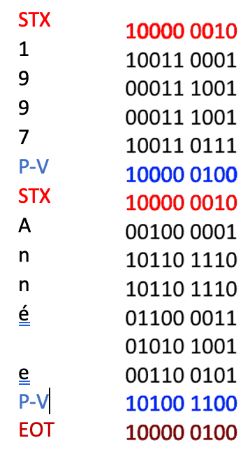

# R1.03 Architecture des ordinateurs

### TD1 
#### Questions clavier :
1.	*Quelle est la taille des mots binaires à utiliser pour un clavier de 105 touches ?*
Chaque touche fait deux codes différents : appui et relâchement.
Il y a donc 105x2=210 codes différents.
Binaire : deux symboles : 0 et 1 
2^8 = 256 > 210, donc la taille des mots sera **8 (8 bits)**.

2.	*Combien de codes ne sont pas utilisés ?*
256 – 210 = **46 codes inutilisés.**

#### Questions UTF :
1.	*De combien de codes dispose-t-on en UTF32, en UTF16 et en UTF8 ?*
**UTF-32** : pas de règle, format fixe de 32 bits, donc 2^32 mots différents, **4 294 967 296 mots différents**.
**UTF-16** : Les 6 premiers bits des mots de 32 bits sont fixes. Il y a donc **2^(32-6) mots différents de 32 bits, soit 2^26 mots**.
Les 6 premiers bits des mots de 16 bits doivent être différents de ceux des 32. Donc il y a **2^(16-6) mots interdits**, soit **2^10 mots interdits en 16 bits**.
Le total en 16 bits est donc de 2^16 (tous) – 2^10 (interdits) mots autorisés en 16 bits.
Cela fait **67 173 376 mots différents** autorisés en 16 bits.
**UTF-8** : 
8 bits -> 1 bit fixe donc 2^(8-1) = **2^7 mots**
16 bits -> 5 bits fixes donc 2^(16-5) = **2^11 mots**
24 bits -> 8 bits fixes donc 2^(24-8) = **2^16 mots**
32 bits -> 11 bits fixes donc 2^(32-11) = **2^21 mots**
Au total, 2^7 + 2^11 + 2^16 + 2^21 = **2 164 864 mots différents**.

#### Questions Digicode :
1.	*Combien de temps au maximum ça prendrait de l'ouvrir en essayant tous les codes ?*
Notre « alphabet » est composé de 12 symboles (1 2 3 4 5 6 7 8 9 A 0 B). Les codes sont de longueur 4. 
Il y a donc 12^4 = **20736 codes différents**.
Divisés par 4 codes à la minute = **5184 minutes** pour trouver = **86,4 heures** = **3,6 jours**.

2.	*Quelqu'un a tapé le code avec des mains sales et on voit des traces sur 4 des 12 touches. Combien de temps au maximum ça prendra pour l'ouvrir ?*
4 touches sont sales, donc le code est composé de **4 symboles différents**.
On peut donc former 4! codes soit 4x3x2x1 codes **soit 24 codes.**
Divisés par 4 codes à la minute = **6 minutes** pour trouver.

3.	*Quelqu'un a tapé le code avec des mains sales mais on ne voit de traces que sur 3 des 12 touches ce qui veut dire qu'une touche sert 2 fois. Combien de temps au maximum ça prendra pour l'ouvrir ?*
3 touches sales, donc deux symboles se répètent dans le code.
Pour trouver et comprendre, il suffit de faire un arbre pour représenter la situation.
Si on fait un arbre pour identifier tous les codes possibles (en supposant que les touches 1, 2 et 3 sont sales) :

Ce sont les cas possibles si on commence par 1. Il y a 12 possibilités.
Donc en tout il y a 12x3 = 36 possibilités.

**Langages avec règles syntaxiques** :
*« Les suites doivent être strictement croissantes. »
Il n’y a qu’une erreur par mot transmis. Alphabet de 5 chiffres (1 2 3 4 5)*
Que peut-on dire si l'on reçoit les 3 messages suivants :
– **34** : Le mot est correctement constitué mais on ne sait pas si c’est le bon mot transmis (cela pourrait très bien être 14 ou 35 par exemple)
– **32** : Deux possibilités : soit le 3 est faux et égal à 1 soit le 2 est égal à 4 ou 5.
– **214** : Le 1 est forcément faux, et égal à 3.

**Mots de passe** :
 

1.	*Calculer la force d’un mot de passe de longueur 8 avec un alphabet de 62 symboles (lettres + chiffres)*
62^8 = 2,183 x 10^14 mots possibles.
2^48 = 2,815 x 10^14 > 2,183 x 10^14.
48 est la puissance de 2 la plus proche où 2^N > 62^8 donc les mots seront de taille 48 bits.
2.	*Calculer la force de votre mot de passe à l’IUT*

### TD2

#### Codage
1.	*Taille de mots binaires pour coder les chiffres en format fixe et en format variable.*
10 chiffres différents (0 1 2 3 4 5 6 7 8 9), donc 10 mots différents.
**Format fixe** : 2^4 = 16 > 10 donc **4 bits**, et **16 mots disponibles**.
**Format variable** : (p^(n+1) – p)/(p-1) (formule de calcul du nombre de mots en forme variable, avec p le nombre de symboles et n la taille maximale) donc :
(2^(n+1) – 2)/(2-1) >= 10.
2^(n+1)-2 >= 10
2^(n+1) >= 12
2^n x 2 >= 12
2^n >= 6
n >= log(6)/log(2)
n >= 2.58
**Comme n est un entier, n = 3**.

Sinon, pour trouver, on teste les différentes valeurs de n dans la formule jusqu’à ce que ça soit supérieur au nombre de mots requis.

2.	*Combien de bits faut-il pour coder un nombre de N chiffres ?*
**Format fixe** : 4 bits par chiffre, N chiffres donc **4N bits nécessaires**.
**Format variable** : **2N bits en moyenne** *(minimum 1N bits, maximum 3N bits)*

3.	*Quels sont les avantages et inconvénients de chacun de ces deux codages pour ce que l'on veut faire ? Doit-on choisir un format de mots binaire fixe ou variable ? Pourquoi ?*
Si on compare le nombre de bits, le format variable est plus avantageux que le fixe.
**L’inconvénient**, c’est que le format variable nécessite des règles permettant de couper les mots sans ambiguïté.
**L’avantage** du format fixe est que les mots sont distinguables directement sans avoir besoin de règles, mais est plus lourd en termes de bits.
**Donc il est préférable de choisir un format de mots binaire variable** avec des règles pour avoir les avantages de taille du format variable en ayant des règles qui permettent de distinguer les mots.

#### Codage 2
1. *Proposer un langage binaire avec une longueur de mots maximale de 5 avec des règles permettant d'effectuer les coupures sans ambiguïté et ayant au moins 10 mots.*
**Règle : Quand on rencontre 0, on s’arrête au suivant**
Cela permet de séparer les codes reçus pour éliminer les ambiguïtés :
Les 10 mots de mon langage seront alors :
**00, 01, 100, 101, 1100, 1101, 11100, 11101, 11110, 11111**.
Exemple : « 01110 » devient « 01 110 ».

#### Codage choisi
1. *Quelle sera la taille moyenne en bits de la représentation d'un nombre de N chiffres ?*
Taille moyenne = (2x2 + 2x3 + 2x4 + 4x5) / 10 = 38/10 = **3**.
**8 bits par chiffre en moyenne**.
La taille moyenne pour N chiffres sera alors de **3,8N bits**.

2. *La comparer avec celle nécessaire en utilisant un format fixe pour coder les chiffres.*
**3,8N < 4N**, donc ça marche mais c’est pas terrible, on a seulement un **gain de 5% sur la taille**.

*Alors, on peut adapter le codage en mettant des codes courts pour les termes les plus fréquents et des plus longs pour les moins fréquents*.

#### Codage futé :
1. *Faire une assignation sémantique permettant d'obtenir le code binaire le plus court possible.*
Nombre d’occurrences des chiffres dans le nombre **194 796 524 930 401** :
-	**Deux** 0
-	**Deux** 1
-	**Un** 2
-	**Un** 3
-	**Trois** 4
-	**Un** 5
-	**Un** 6
-	**Un** 7
-	**Zéro** 8
-	**Trois** 9

**9 et 4 apparaissant le plus souvent**, on va les assigner aux mots les plus courts (on choisit lesquels de manière arbitraire).
**9 -> 00
4 -> 01**
**0 et 1 sont ceux qui apparaissent le plus souvent après 9 et 4**, donc on va les assigner aux mots les plus courts restants.
**1 -> 100
0 -> 101**
**Pour le reste, on range aléatoirement** dans les mots restants (*sauf pour le 8 qui lui sera forcément un mot de longueur 5 vu qu’il n’apparaît jamais*)
**2 -> 1100
3 -> 1101
5 -> 11100
6 -> 11110
7 -> 11101
8 -> 11111**

2. *Comparer la taille du mot binaire obtenue à la moyenne calculée précédemment et à celle obtenue en format fixe*
**En format fixe**, on aurait eu du 4N = 4x15 = **60 bits**.
**En format variable**, avec notre assignation, on a du :
6x2 + 4x3 + 2x4 + 3x5 = **47 bits**.
**On a gagné 13 bits !**

*Sinon, si on avait assigné au pif, cela aurait fait 3.8x15 = 57 bits.
Cette méthode permet de gagner de la place mais on perd un peu de temps à coder et décoder.*

#### Codage de Huffman (le génie) :
**Utilisation :**
*Reprenons notre exemple de représentation du nombre 194 796 524 930 401*
1.	*Quelle taille de code obtient-on pour ce nombre en utilisant la méthode de Huffman ?*
Occurrences décroissantes des chiffres :

**100 11 000 0101 11 0100 0011 101 000 11 0010 011 000 011 100 = 46 bits**.
2. *Comparer la taille du mot binaire obtenue *
1. *A la taille que nous avions obtenue avec notre code séparable* 
**47 – 46 = 1 bit gagné !**
2.	*A la taille avec un codage en format fixe*
**60 – 46 = 14 bits gagnés**.

### TD3

#### Taille des registres :
1.	*Quelles sont les tailles des registres RM et RA de cette mémoire ?*

*Le terme « PC » de « PC32000 » révèle que la mémoire est organisée en mots de 64 bits.
RM contient une copie d’un mot en mémoire, il a donc la même taille qu’un mot en mémoire donc est de 64 bits.*

La mémoire est de 4 Go (or 1 Go = 1024 Mo), or chaque information est sur 64 bits (64/8 = 8 octets), le nombre d’informations dans la zone de stockage est donc de (4x1024)/8 = **512 Mo mots de 64 bits**.

Il faut donc **512x2^20 adresses différentes**. 2^9x2^20 = **2^29**.
Donc **RA vaut 29 bits**.

**Temps d’accès :**

1.	*Quel sera le temps nécessaire si ces 64 informations sont placées à des adresses quelconques non voisines ? Quel est alors le temps d'accès moyen pour lire une information ?*

Les informations sont non-voisines donc on va répéter la somme t1 + t2 pour chaque lecture d’information.
**t1 = t2 x 2 x CL**		
**t2 = 1/fréquence de débit**

Ici t2 = 1/4000MHz = 1/(4000 x 10^6)Hz = 2.5 x 10^-10 s = **0.25 ns**
t1 = 0.25 x 2 x 19 = **9.5 ns**

T = 64x(t1 + t2) = 64x (0.25 + 9.5) = 64x 9.75 = **624 ns pour 64 informations non-voisines**.

624 / 64 = **9.75 ns par information.**

2. *Quel sera le temps nécessaire si ces 64 informations constituent un bloc de données voisines ? Quel est alors le temps d'accès moyen pour lire une information ?*

Informations voisines = un seul calcul de t1
T = t1 + 64 x t2
T = 9.5 + 64 x 0.25
T = 25.5 ns pour 64 informations voisines

**25.5 / 64 = 0.398 ns par information. On va 24 fois plus vite**.

#### Exécution d’un programme :

1.	*Combien de temps met ce programme à s’exécuter ?*
1000 x 10 x 9.75 (lecture des instructions) = **97500 ns**
1000 x 4 x 9.75 (lecture ou écriture des variables) = **39000 ns**
(1000 x 10) / (5x10^9) (exécution des instructions) = **2000 ns**

Le temps d’exécution du programme est donc la somme de tous ces temps.
**T = 97500 + 39000 + 2000 = 138500 ns dont 98% du temps à cause de la mémoire**.

#### Principe de cache :

1. *Combien de temps mettra le même programme à s’exécuter avec ce cache ?*
**Copie des instructions** : t1 + 10 x t2 = 9.5 + 10 x 0.25 = **12 ns**
**Copie des variables** : t1 + 4 x t2 = 9.5 + 4 x 0.25 = **10.5 ns**
**Accès aux instructions dans le cache** : 1000 x 10 x 0.5 = **5000 ns**
**Accès aux variables dans le cache** : 4 x 1000 x 0.5 = **2000 ns**
**Exécuter les instructions** : **2000 ns**
**Recopie des variables** : t1 + 4 x t2 = **10.5 ns**
**Total** : **9033 ns dont 78% pour la mémoire** (*on va 15x plus vite avec le cache*)

#### Encodage/Décodage vidéo :
1.	*Calculer la puissance de processeur nécessaire (en GIPS) pour faire le décodage de la full HD en temps réel.*
**Full HD = 1920x1080**
**Instructions par image** : 1920x1080x70 = **145 152 000 instructions par image**
**Instructions par 30 images** : 145 152 000 x 30 = **4 354 560 000 instructions par seconde à effectuer**.

Il faudra donc un processeur de **4.35456 GIPS minimum**.

2.	*Un seul cœur de processeur de type core i7 8700K (5,92 GIPS) suffit-il ?*
**5,92 > 4.35456 donc cela suffirait** (*il serait à 74% d’utilisation*).

3.	*Combien de temps faut-il pour encoder 1 heure de vidéo full HD sur un core i7 8700K en n’utilisant qu’un seul cœur (5,92 GIPS).*
I = 1920x1080x400x30 = **24 883 200 000 instructions par seconde** = (x3600) **89 579 520 000 000 instructions par heure**.
On divise par la puissance d’un cœur de notre processeur (5.92 GIPS donc 5 920 000 000)
T = I/5 920 000 000 = 15131.675675675… s = **4.203243243… h**

4.	*Et en utilisant les 6 cœurs en même temps ?*
Puissance = 5.92 x 6 = **35.52 GIPS**
T = I/35 520 000 000 = 2521.945945… s = **0.700540540… h**

#### CD ROM :

1.	*Sur combien de bits sera codée chaque mesure ?*
2^12 = 4096 > 4095.
Donc **12 bits**.

2.	*Combien de bits faut-il pour représenter une seconde de musique en stéréo ?*
**44100 mesures par seconde par voie stéréo**
2 voies stéréo donc 44100 x 2 = **88200 mesures par seconde**.
On multiplie par le nombre de bits que prend une mesure, soit 12.
88200 x 12 = **1 058 400 bits**.
3.	*Lorsque l'on écoute un CD audio, la platine CD transmet à la carte son les informations lues octet par octet. Quel est le débit en octets/seconde nécessaire pour entendre correctement la musique ?*
**1 058 400 bits par seconde de musique**.
On divise par 8 pour avoir l’équivalent en octets.
1 058 400 / 8 = **132 300 octets par seconde de musique**. C’est donc le **débit nécessaire minimum** pour entendre correctement la musique.

#### Durée maximale : 
1. *Quelle est la durée maximale de musique que l'on peut y enregistrer ?*
Le CD audio contient **682 Mo de données**.
(682 x 14)/100 = **95.48 Mo occupés** pour les informations diverses et les bits de correction.
682 – 95.48 Mo = **586.52 Mo d’espace libre** pour enregistrer de la musique.
586.52 Mo = 586.52 x 10^6 octets.
On divise par le nombre d’octet par seconde pour obtenir le nombre de secondes pouvant être enregistrées.
586.52 x 10^6 / 132 300 = **4433 s** = **73.88 minutes de stockage**.

### TD4

**Code UTF-8** :

1.	**Quels sont les codes à émettre ?
« Bonjour » = **0100 0010 | 0110 1111 | 0110 1110 | 0110 1010 | 0110 1111 | 0111 0101 | 0111 0010**

**Recherche d’un code détecteur d’erreur** : 

1.	*Pour ceux qui n’ont pas d’erreur quel caractère représentent-ils ? Pour ceux qui ont une erreur quels caractères ça pouvait être ?*
00110000 11000011 -> « **I** » (i majuscule)
00110111 00110011 -> erreur -> **« U » ou « u »**
00110011 00100000 -> erreur -> **« T » ou « P »**

2.	*S’il pouvait y avoir 2 erreurs dans le même mot la détection d’erreur marcherait-elle ?*
Si 2 erreurs se produisent : 
-	Soit c’est sur les 2 bits d’un groupe -> erreur indétectable
-	Soit elles concernent 2 bits séparés -> On voit deux erreurs (mais il y a quatre possibilités de correction)
Parité :
1.	*On veut envoyer en UTF8 le mot "Bonjour" en ajoutant un bit de parité à gauche à chaque code UTF8. Quels sont les codes envoyés ?*
**00100 0010 
00110 1111 
10110 1110 
00110 1010 
00110 1111 
10111 0101 
00111 0010**
2.	*S’il pouvait y avoir 2 erreurs dans le même code UTF8 la détection d’erreur marcherait-elle ?*
Si deux erreurs se produisaient, on ne verrait rien du tout.

3.	*Quel est le nombre de bits envoyés si on utilise la méthode vue précédemment qui envoie chaque bit en double et si on utilise la méthode de la parité ?*

Bits en double = (902 x 8 + 88 x 16 + 8 x 24 + 2 x 32) x 2 = **17 760 bits**.
**Méthode de parité** = 8880 bits (la somme d’au-dessus) + 902 bits de parité pour le 8 bits + 176 bits de parité pour le 16 bits + 24 bits de parité pour le 24 bits + 8 bits de parité pour le 32 bits = **9990 bits**
**Gain de taille de 44%**.

#### Meilleure solution :

1.	*Lesquels sont justes et lesquels sont faux ?*
– 000111111**010** 000000111000
– 000111111000 111111111111
– 000000111111 000000**110**000

2.	*Corriger les erreurs quels sont les caractères envoyés ?*
On corrige les erreurs en remplaçant le bit erroné (il n’y a qu’une seule erreur).
**Les caractères envoyés sont donc « b », « o » et « n »**.

3.	*S’il pouvait y avoir 2 erreurs dans le même mot pourrait-on corriger l’erreur ? Pourrait-on au moins la détecter ?*
S’il y a deux erreurs :
-	Dans le même groupe -> **On les voit mais on ne sait pas la corriger**
-	Dans des groupes différents -> **On les voit ET on peut les corriger**

#### Parité bidimensionnelle :

1.	*On corrige les erreurs à l’aide des deux parités. Le message reçu était « Informatique »*.

2.	*2 erreurs dans le même bloc :*
-	Même ligne : **On sait mais on peut pas corriger**
-	Même colonne : **On sait mais on peut pas corriger**
-	Deux lignes et deux colonnes différentes : **On sait mais on peut pas corriger (2 solutions possibles)**

#### Évaluation :
*Reprenons notre texte de 1000 caractères en UTF-8 précédent.*
1.	*Quel est le nombre de bits envoyés si on utilise la méthode vue précédemment qui envoie chaque bit en triple exemplaire et si on utilise la méthode de la parité bidimensionnelle en mettant un contrôle chaque 6 octets ?*
**Taille du texte = 1110 octets**
Bits en triple = (902 x 8 + 88 x 16 + 8 x 24 + 2 x 32) x 3 = **26 640 bits**.
Méthode de parité bidimensionnelle = 1110 + (1110/6) octets = 1295 octets x 8 = 10360 bits + 1 bit sur chaque octet soit 1295 = 10360 + 1295 = **11655 bits**.

#### Transmission de textes :

1.	*Quels sont les codes émis pour transmettre le texte de 2 lignes suivant :* 
“1997
Année”

2.	*En quoi ce texte présente-t-il un problème pour le récepteur ?*
**Le code de la première parité verticale est le même que le code de fin de texte**.

3.	*Quelle solution proposer à ce problème de mauvaise interprétation ?*
**Solution : Mettre un caractère devant tout code portant à confusion**.
On utilise le code « **DLE** » pour faire ça.
**DLE = 0001 0000**
Ce code permet d’annuler l’interprétation et de protéger. Si un code tombe sur DLE par hasard, il faut également le protéger avec un DLE.

### TD5

#### Entiers naturels :
1.	*Représenter en binaire sur 12 bits les 3 entiers naturels 26, 96 et 2479*
**26 : 000000011010 (16+8+2)**
**96 : 000001100000 (64+32)**
**2479 : 100110101111 (2048 + 256 + 128 + 32 + 8 + 4 + 2 + 1)**
2.	*Quelles sont les valeurs du plus petit et du plus grand entier naturel que l’on peut représenter sur 12 bits ? Sur n bits ?*
**Plus petit sur 12 bits : 000000000000 qui vaut 0**
**Plus grand sur 12 bits : 111111111111 qui vaut 4095**
**Plus petit sur n bits : 00000… qui vaut 0**
**Plus grand sur n bits : 11111… qui vaut 2n – 1**

#### Entiers relatifs :
1.	*Représenter en binaire en complément à 2 sur 12 bits les 4 entiers relatifs : 65 –65 96 et -96*
**65 : 000000100001
-65 : 111111011111
96 : 000001100000
-96 : 111110100000**

2.	*Que valent les entiers relatifs suivants représentés en complément à 2 sur 12 bits :*
0000 1011 0101 : **181**
0000 1010 0110 (inverse du deuxième nombre) = 2+4+32+128 = **166**
Donc le deuxième nombre vaut **-166**.
0000 0010 0101 (inverse du troisième nombre) = 1+4+32 = **37**
Donc le troisième nombre vaut **-37**.

3.	*Quels sont le plus petit et le plus grand entier relatif représentable sur 12 bits ? Sur n bits ?**
0111 1111 1111 (plus grand nombre positif) = **2047**
1000 0000 0001 (opposé du plus grand nombre) = **-2047**
Sur n bits, le plus grand nombre vaut **2(n-1) – 1** (à cause du bit de gauche indiquant le signe).
Le plus petit est son opposé, soit **–(2(n-1) – 1)**.

#### Opérations logiques :

1.	*Que représente C en UTF8 ?*
D’après la table UTF8, **C représente 5**.
2.	*Que représente X = C ^ M1 considéré comme un entier naturel binaire ?*
       C = 0011 0101
       ^ M1 = 0000 1111
       **X = 0000 0101**
3.	*Que représente Y = X v M2 considéré comme un code UTF8 ?*
       X = 0000 0101
       v M2 = 0011 0000
       **Y = 0011 0101**, qui en UTF8 représente également **5**. **Y = C**.

#### Ou Exclusif :
1.	*Calculer le OU exclusif de C et M1 et de C et M2*
       C = 0011 0101
       (+) M1 = 0000 1111
       **0011 1010**
        
       C = 0011 0101
       (+) M2 = 0011 0000
       **0000 0101**

       C = 0011 0101
       M1 = 0000 1111
       **PV = 0011 1010**

       C = 0011 0101
       M2 = 0011 0000
       **PV = 0000 0101**
       *En fait le OU exclusif permet de calculer la parité*.

#### Hexadécimal :
1.	*Représenter 96 et 2479 en base 16*
96 = 6*16 + 0 = **60**
2479 = 9*16^2 + 10*16 + 15 = **9AF**

2.	*Convertir en décimal les nombres hexadécimaux suivants : 1328 et 9AF*
1328 = 1*16^3 + 3*16^2 + 2*16^2 + 8*16^1 = **4904**
9AF = 9*16^2 + 10*16^1 + 15 = **2479**

3.	*Comparer les valeurs du 1° avec celles des entiers naturels 96 et 2479 en binaire sur 12 bits (déjà vus), que remarque-t-on sur le passage binaire <-> hexadécimal ?*

#### Opérations de décalage :

1.	*Que valent DLG de +17 et de -17 considérés comme entiers relatifs en complément à 2 sur 8 bits ?*
**17 : 0001 0001
-17 : 1110 1111
DLG 17 : 0010 0010 = 34
DLG -17 : 1101 1110 = -34
DLG = multiplication par 2**

2.	*Que valent DAD de +17 et de -17 considérés comme entiers relatifs en complément à 2 sur 8 bits ?*
**DAD = déplacement vers la droite et ajout des bits de signe à la place
DAD 17 : 0000 1000 = 8
DAD -17 : 1111 0111 = -9 (opposé de 9)
DAD = partie entière de la division par 2**

3.	*Que vaut 3 DLG de +17 et de -17 considérés comme entiers relatifs en complément à 2 sur 8 bits ?*
**3 DLG 17 : 1000 1000 = -120 (opposé de 120)
3 DLG -17 : 0111 1000 = 120**
*On devrait trouver 136 et -136 mais vu qu’on est sur 8 bits en Cà2 les nombres ne vont que de -127 à +127.
En fait le DLG plusieurs fois fait la multiplication par 2^n avec n le nombre de répétition*.

4.	*Que valent DAD 4 fois de +17 et de -17 et DAD 5 fois de +17 et -17 considérés comme entiers relatifs en complément à 2 sur 8 bits, que remarque-t-on ?*
**4 DAD 17 : 0000 0001 = 1
4 DAD -17 : 1111 1110 = -2 (opposé de 2)
5 DAD 17 : 0000 0000 = 0
5 DAD -17 : 1111 1111 = -1 (opposé de 1)**
*C’est logique car le DAD fait la partie entière de la division par 2 donc inévitablement on arrive à 0 quand le nombre est positif ou -1 quand le nombre est négatif*.

### TD6

#### Méthode de Hamming :
*Pour envoyer un message de N bits en pouvant le corriger s’il n’y a pas plus d’une erreur on va ajouter K bits de contrôle à ce message
K doit être choisi comme le plus petit entier tel que 2k ≥ N+K+1
On veut envoyer une information de 16 bits, on peut soit l’envoyer en 2 mots de 8 bits avec la parité bidimensionnelle, soit en 1 mot de 16 bits avec contrôle de Hamming*
1.	*Combien de bits ajoute-t-on pour la parité bidimensionnelle ?*
Avec la parité bidimensionnelle, on ajoute un mot de 8 bits pour faire la parité verticale et un bit devant chaque mot pour la parité horizontale.
**BSup = 8 + 1 x 3 = 11 bits supplémentaires**

2.	*Combien de bits ajoute-t-on pour le contrôle de Hamming ?*
On ajoute K bits avec 2^K >= N+K+1 or notre mot mesurer 16 bits
Donc on cherche un K pour lequel **2^K >= 16+K+1**
On teste les valeurs de K jusqu’à trouver le plus petit entier pour lequel ça marche.
**K = 5**.
**Donc on ajoute 5 bits supplémentaires**.

3.	*Même question avec une information de 8000 bits découpées en 100 mots de 80 bits pour la parité bidimensionnelle et en un mot de 8000 bits pour Hamming*
Avec la parité bidimensionnelle, on ajoute un mot de 80 bits pour la parité verticale et un bit par mot pour la parité horizontale.
**BSup = 80 + 1 x 101 = 181 bits supplémentaires**.
Avec la méthode de Hamming, on cherche un K pour lequel **2^K >= 8000+K+1**
On teste les valeurs de K jusqu’à trouver le plus petit entier pour lequel ça marche.
**K = 13**.
**Donc on ajoute 13 bits supplémentaires**.
*On fait 10x moins de bits avec Hamming*.

#### Bits de contrôle :

1.	*Calculer les codes à envoyer pour les 2 messages sur 10 bits suivants :
11 0101 0011
01 1101 0010*

On calcule la valeur de K à l’aide de la formule **2^K >= N+K+1** sachant que nos mots sont sur 10 bits donc **N = 10**.
On trouve **K = 4** (pas besoin de le recalculer pour chaque mot vu que les mots ont la même taille). **Les bits de contrôle seront donc sur les 4 premières puissances de 2 (1 2 4 8)**

| T | a | b | l | e | a | u |  |  |  |  |  |  |  |
| :----:  | :----:  | :----:  | :----:  | :----:  | :----:  | :----:  | :----:  | :----:  | :----:  | :----:  | :----:  | :----:  | :----:  |
| 14 | 13 | 12 | 11 | 10 | 9 | 8 | 7 | 6 | 5 | 4 | 3 | 2 | 1 |
| 1 | 1 | 0 | 1 | 0 | 1 |  | 0 | 0 | 1 |  | 1 |  |  |
| 0 | 1 | 1 | 1 | 0 | 1 |  | 0 | 0 | 1 |  | 1 |  |  |

**On fait la parité verticale des positions ayant des 1 :**

*On place ces parités dans les emplacements réservés aux bits de contrôle*.

| T | a | b | l | e | a | u |  |  |  |  |  |  |  |
| :----:  | :----:  | :----:  | :----:  | :----:  | :----:  | :----:  | :----:  | :----:  | :----:  | :----:  | :----:  | :----:  | :----:  |
| 14 | 13 | 12 | 11 | 10 | 9 | 8 | 7 | 6 | 5 | 4 | 3 | 2 | 1 |
| 1 | 1 | 0 | 1 | 0 | 1 | 0 | 0 | 0 | 1 | 1 | 1 | 1 | 1 |
| 0 | 1 | 1 | 1 | 0 | 1 | 0 | 0 | 0 | 1 | 1 | 1 | 1 | 0 |

*Les mots binaires ainsi formés correspondent à nos mots codés avec la méthode de Hamming*.

#### Vérification d’un message reçu :
**Méthode :**
-	Relever les positions des bits de messages qui sont à 1 (sans tenir compte des bits de contrôle).
-	Coder chacune de ces positions par un entier naturel binaire sur K bits
-	Calculer la parité verticale de ces entiers naturels binaires
-	Puis faire la parité entre la parité verticale que l’on vient d’obtenir et les bits de contrôle qu’on a reçu
Le résultat donne un entier naturel qui indique la position de l’erreur, si on obtient 0, c’est qu’il n’y a pas d’erreur

*On a reçu les deux messages contrôlés par Hamming suivants :
	1010 0010 0110
	0110 0000 1010*
1.	*Combien contiennent-ils de bits de contrôle et où sont-ils ?*
On a reçu 2 messages de 12 bits donc **N+K = 12**. On cherche K. 
On a deux solutions :
-	 La plus simple c’est de dire que les positions sont numérotées de 1 à 12 donc que les bits de contrôle sont en 1, 2, 4 et 8 et il y en a 4
-	La plus compliqué c’est de dire que K est le plus petit entier tel que **2k ≥ N+K+1 donc ici 2k ≥ 13** et on trouve **K = 4**
*Donc on a 4 bits de contrôle en position 1, 2, 4 et 8 et le message original est sur 8 bits*
2.	*Corriger ces deux messages*
Sous forme de tableau numéroté, voici les messages que l’on a reçu :

| T | a | b | l | e | a | u |  |  |  |  |  |
| :----:  | :----:  | :----:  | :----:  | :----:  | :----:  | :----:  | :----:  | :----:  | :----:  | :----:  | :----:  |
| 12 | 11 | 10 | 9 | 8 | 7 | 6 | 5 | 4 | 3 | 2 | 1 |
| 1 | 0 | 1 | 0 | 0 | 0 | 1 | 0 | 0 | 1 | 1 | 0 |
| 0 | 1 | 1 | 0 | 0 | 0 | 0 | 0 | 1 | 0 | 1 | 0 |

*On suit la méthode, on va faire la parité des positions à 1 (sans bits de contrôle)*.

*On peut donc corriger les erreurs*.

| T | a | b | l | e | a | u |  |  |  |  |  |
| :----:  | :----:  | :----:  | :----:  | :----:  | :----:  | :----:  | :----:  | :----:  | :----:  | :----:  | :----:  |
| 12 | 11 | 10 | 9 | 8 | 7 | 6 | 5 | 4 | 3 | 2 | 1 |
| 1 | 0 | 1 | 0 | 0 | 0 | 1 | 0 | 0 | 1 | 1 | 1 |
| 0 | 1 | 1 | 0 | 0 | 1 | 0 | 0 | 1 | 0 | 1 | 0 |

3.	*Quelles sont les valeurs des messages reçus si ce sont des entiers relatifs en complément à 2 ?*
On retire les bits de contrôle pour lire le message original.
Le premier message reçu est : **1010 0101**.
C’est un entier relatif négatif dont **l’opposé est 0101 1011 qui vaut 91, on a donc reçu -91**.
Le second message reçu est : **0110 1000**.
C’est un entier relatif positif qui vaut **104**.

### TD7

*Soit A le langage {a, ab, bba} et B le langage {baa, aa, bb} les deux langages ont le même nombre de mots (3 ici)*

**Règles du jeu :**
-	On choisit N rangs (un rang est un entier entre 1 et 3) on peut prendre N aussi grand qu’on veut et mettre autant de fois que l’on veut les mêmes rangs
-	On forme un premier mot X en concaténant les N mots de A correspondant à ces rangs
-	Puis on forme un second mot Y en concaténant les N mots de B correspondant à ces rangs
Exemple :
-	Si on choisit les rangs 1, 2, 2, 1, 3 on obtient :
	X = aabababba
	Y = baaaaaabaabb
1.	*En suivant cette règle du jeu, trouver la liste de rangs la plus courte telle que les deux mots X et Y soient identiques*
Liste la plus courte pour deux mots identiques : 3, 2, 3, 1
X = bba|ab|bba|a = bbaabbbaa
Y = bb|aa|bb|baa = bbaabbbaa
X = Y.
Il y a plein d’autres solutions de taille supérieure (en fait une infinité puisqu’on peut évidemment pendre 3, 2, 3, 1, 3, 2, 3, 1 pour N=8 etc.)

*Soit A le langage {bbab, abba, b} et B le langage {b, bb, bba}*

2.	*En suivant cette règle du jeu avec ces deux nouveaux langages, trouver la liste de rangs la plus courte telle que les deux mots X et Y soient identiques*

Le plus petit c’est une liste de 252 nombres.

| Etat/symbole lu | 0 | 1 | ε |
| :----:  | :----:  | :----:  | :----:  |
| q0 | q0/0/D | q0/1/D | q1/ε/G |
| q1 | q0/1/ARRET | q1/0/G | q0/1/ARRET |

1.	*Que va donner cette machine de Turing pour une entrée égale à ε000ε ?*
**1 -> 0 en q0 (état initial), donc q0, 0, D
2 -> 0 en q0, donc q0, 0, D
3 -> 0 en q0, donc q0, 0, D
4 -> ε en q0, donc q1, ε, G
5 -> 0 en q1, donc q0, 1, ARRET**

*On est passés de ε000ε à ε001ε*.

2.	*Que va donner cette machine de Turing pour une entrée égale à ε011ε ?*
**1 -> 0 en q0 (état initial), donc q0, 0, D
2 -> 1 en q0, donc q0, 1, D
3 -> 1 en q0, donc q0, 1, D
4 -> ε en q0, donc q1, ε, G
5 -> 1 en q1, donc q1, 0, G 
6 -> 1 en q1, donc q1, 0, G
7 -> 0 en q1, donc q0, 1, ARRET**
*On est passés de ε011ε à ε100ε*.

3.	*Que va donner cette machine de Turing pour une entrée égale à ε111ε ?*
**1 -> 1 en q0 (état initial), donc q0, 1, D
2 -> 1 en q0, donc q0, 1, D
3 -> 1 en q0, donc q0, 1, D
4 -> ε en q0, donc q1, ε, G
5 -> 1 en q1, donc q1, 0, G
6 -> 1 en q1, donc q1, 0, G
7 -> 1 en q1, donc q1, 0, G
8 -> ε en q1, donc q0, 1, ARRET**
*On est passés de ε111ε à ε1000ε*.

4.	*Définir la machine de Turing qui remplace un entier relatif binaire en complément à 2 par l’entier relatif binaire en complément à 2 qui est son opposé.*

| Etat/symbole lu | 0 | 1 | ε |
| :----:  | :----:  | :----:  | :----:  |
| q0 | q0, 0, D | q0, 1, D | q1, ε, G |
| q1 | q1, 0, G | q2, 1, G | q0, ε, ARRET |
| q2 | q2, 1, G | q2, 0, G | q0, ε, ARRET |

### TD8
#### Codage RVB :
1.	*Quelles valeurs (minimale et maximale) peuvent prendre chacune des composantes ?*
Les composantes sont représentées par un entier naturel de 8 bits donc leurs valeurs peuvent aller de 0 à 255 (2^n – 1) = **256 possibilités de valeurs**
2.	*Combien de couleurs différentes peut-on représenter sous cette forme ?*
Deux méthodes :
-	Soit on utilise la formule de nombre de mots en format fixe (ici en binaire de taille 24 bits) donc **2^24**.
-	Soit on multiplie les 256 possibilités de valeurs pour chaque couleur (rouge, vert et bleu), et on obtient 256x256x256 = **2^24**.
3.	*Écrire le nombre hexadécimal représentant une couleur dont :
	La composante rouge est à 65% de sa valeur maximale
	La composante verte est à 24% de sa valeur maximale
	La composante bleue est à 15% de sa valeur maximale*
**La valeur maximale des composantes est 255**.
**Rouge à 65%** = 0.65 x 255 = 166 (on arrondit à l’entier) = 10*16^1 + 6 = **A6**
**Vert à 24%** = 0.24 x 255 = 61 = 3*16^1 + 13 = **3D**
**Bleu à 15%** = 0.15 x 255 = 38 = 2*16^1 + 6 = **26**
**Code en hexadécimal (on concatène rouge, vert et bleu en hexa) : A63D26**

#### Passage en noir et blanc (niveaux de gris) en RVB :

*Le gris est représenté par une couleur dont les 3 composantes (R, V et B) ont la même valeur. Plus cette valeur est élevée, plus le gris est clair (au maximum, on a du blanc).*
On peut passer d’une image couleur à une image noir et blanc (niveaux de gris) en utilisant la formule suivante :
**G = (0,2125 * R + 0,7154 * V + 0,0721 * B) arrondi à l’entier le plus proche**
La couleur correspondante est un gris dont les 3 composantes valent **G**.

1.	*Transformer en niveaux de gris la couleur dont le code hexadécimal en RVB est A42E14 (c’est un marron foncé)*

Pour transformer en niveaux de gris la couleur dont le code hexadécimal en RVB est **A42E14**, on convertit chaque composante en décimal :
	**R = A4 -> 10*16+4 = 164
	V = 2E -> 2*16+14 = 46
	B = 14 -> 16+4 = 20**

Puis on applique la formule de calcul de G :
**G = (0,2125 * 164 + 0,7154 * 46 + 0,0721 * 20) = 69,2004** que l’on arrondit à **69 qui en hexadécimal s’écrit 45** (4*16+5).
	Le code gris est donc **#454545**.

#### Conversion RVB TSL :

1.	*Quel est le code hexadécimal représentant en TSL la couleur dont le code hexadécimal en RVB est A42E14 ?*
Le code hexadécimal en TSL est donc **7BC57**.

2.	*Quelles sont les valeurs de T, S et L quand la couleur est le gris dont chaque composante RVB vaut G ?*
En appliquant l’algorithme ci-dessus :
**M <- G
m <- G
Σ <- 2G
Δ <- G – G = 0
T0 <- 4
T <- T0 x 40 = 4 x 40 = 160
S <- 0
L <- Σ x 8/17 = 2G x 8/17 = 16G/17**

**TSL = 160 0 16G/17**

*T ne sert à rien vu qu’en gris il n’y a pas de teinte.*
*S vaut 0 donc du gris.*
*L joue sur les niveaux de gris.*

#### Codage YCbCr
• Calcul de R, V et B à partir de Y, Cb et Cr:
- R= Y + 1,402* (Cr-128)
- V= Y - 0,34414 (Cb-128) - 0,71414* (Cr-128)
- B= Y + 1,772* (Cb-128)

1. *Quelles sont les valeurs de R, V et B quand Y= 150 Cb = 100 et Cr = 60 ?*
R=55, V=208, B=100
2. *Si on modifie une chrominance, par exemple Cb, en la diminuant de 50, quelles sont les nouvelles valeurs de R V et B ?*
R=55, V=225, B=12
3. *Si on modifie la luminance Y en en la diminuant de 50, quelles sont les nouvelles valeurs de R V et B?*
R=5, V=158, B=50 
4. *Que constate-t-on?*
En baissant une chrominance (Cb) : R ne varie pas, V varie peu (17) et B varie beaucoup (88) car Cb est la chrominance bleue mais l'œil est peu sensible au bleu donc la couleur est peu dégradée (un peu plus verte) En baissant la luminance (Y) : R, V et B baissent de 50 donc la couleur est plus foncée