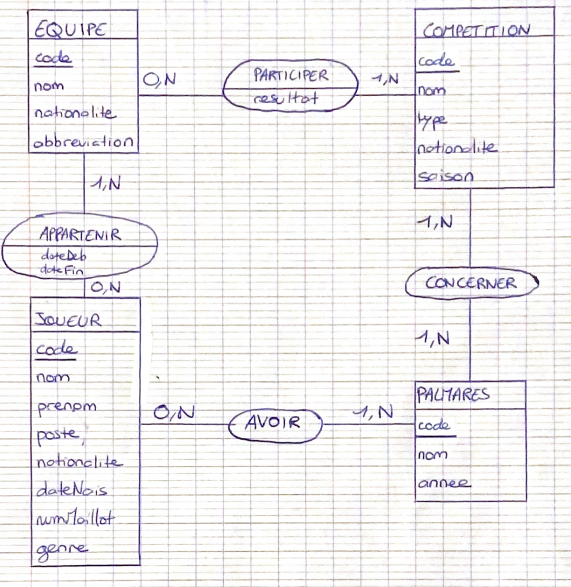

# TD4

#### MCD de Merise

#### Schéma relationnel
**Equipe** (**code**, nom, nationalite, abbreviation)
**Competition** (**code**, nom, type, nationalite, saison)
**Joueur** (**code**, nom, prenom, poste, nationalite, dateNais, numMaillot, genre)
**Palmares** (**code**, nom, annee, #codeJoueur, #codecompetition)
**Appartenir** (dateDeb, dateFin,**#codeJoueur, #codeEquipe**)
**Participer** (resultat, **#codeEquipe, #codeCompetition**)

#### Ecrire les requêtes de modification du schéma

#### Peupler la BD