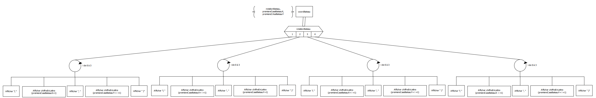

# S1.02 Comparaisons d'approches algorithmiques

## Algo
#### Algo Principal

#### Initialisation Partie

#### Déroulement de la partie

#### Fin de partie

#### Sous - programmes
**bateau.h**
###### Initialisation du Bateau
```cpp
// BUT : Initialise la position de bateau à trouver dans un tableau de booléen bateau, orienté sous 4 formes (vertical
//       horizontale, diagonale Haut-Droit/Bas-Gauche, diagonale Haut-Gauche/Bas-Droit) rotationBateau et la 
//       première case (premiereCaseBateauX, premiereCaseBateauY) est trouvée aléatoirement.
```

###### Coordonnées du Bateau
```cpp
// BUT : Affiche les coordonnées du bateau dans l'affichage des règles pour pouvoir le retrouver. Nous avons seulement besoin de
//       savoir l'orientation de bateau rotationBateau ainsi que la première case (premiereCaseBateauX, premiereCaseBateauY).
```

**jeu.h**
###### Initialisation des tableaux
```cpp
// BUT : Initialiser le tableau booléen tab1 de nbCases à false et le tableau de caractères de nbCases à " ".
```

###### Affichage du Tableau
```cpp
// BUT : Affiche le tableau tableau de nbCases avec les coups précédement joués (s'il y en a) sinon le tableau est affiché vide.
```

###### Déterminer Colonne
```cpp
// BUT : Détermine d'après la saisie de joueur saisieJoueur le numero de colonne Colonne qu'il veut jouer.
//       Exemple : Colonne A correspond à 0 quand on accède au tableau
```

###### Déterminer Ligne
```cpp
// BUT : Détermine d'après la saisie de joueur saisieJoueur le numero de la ligne Ligne qu'il veut jouer.
//       Exemple : Ligne 2 correspond à 1 qaund on accède au tableau
``` 

###### Affichage des règles
```cpp
// BUT : Affiche les règles du jeu ainsi que les coordonnées du bateau grâce à l'orientation rotationBateau et de la première case
//       (premiereCaseBateauX, premierecaseBateauY).
```

###### Conversion chiffre en lettre
```cpp
// BUT : Converti l'entier court non signé CaseY en caractère correspondant à la lettre de la colonne où il se situe
//       Exemple : Colonne 2 = 'B'
```

###### Vérification des coordonnées
```cpp
// BUT : Affiche, tant que saisieJoueur (les coordonnées entrées en X & Y) ne sont pas bonnes, un message de saisi ainsi que nbTour (le numero du tour joué).
//       Lorsque la coordonnée X n'est pas bonne "Erreur en X !" est affiché
//       Lorsque la coordonnée Y n'est pas bonne "Erreur en Y !" est affiché
//       Et si les deux coordonnées ne sont pas bonne les deux message seront affichées. Le numero du tour ne change pas tant que la saisie n'est pas bonne.
```

###### Touché ou coulé
```cpp
// BUT : Suivant les coordonnees entrées, on regarde :
//       -  Si tab1[Ligne][Colonne] = true, si oui et que tab2[Ligne][Colonne] est différent de 'o', on ajoute le caractère 'o'
//          à tab2[Ligne][Colonne] et on incrémente compteur (le compteur de cases du bateau trouvés).
//       -  Sinon, si tab1[Ligne][Colonne] = false et que tab2[Ligne][Colonne] est différent de '.', on ajoute le caractère '.' à tab2[Ligne][Colonne].
```

