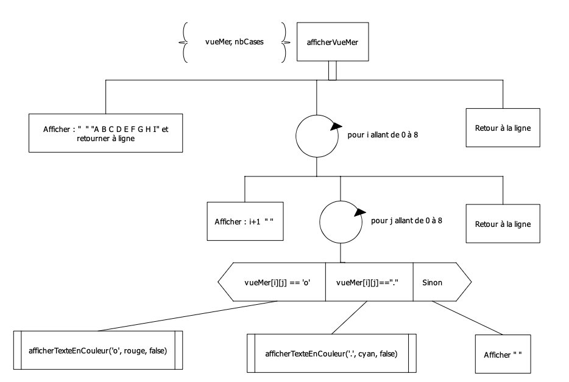

## SAE 1.02 - Comparaisons d'approches algorithmiques

#### <span style='color:#658488'>1.  Equipe</span>
NAUDI Colas TD2-TP4
SUHUBIETTE Matteo TD2-TP4
TRAN Gatien TD2-TP4

#### <span style='color:#658488'>2.  Exercice traité Pack</span>
Sujet 3 - Bataille Navale

#### <span style='color:#658488'>3.  Rappel des spécifications du programme</span>

##### <span style='color:#18535A'>3.1  Spécifications initiales</span>

Le joueur doit rentrer des coordonnées sous la forme (Lettre,Chiffre) correspondant au numero de la ligne et de la colonne du point où il veut tirer ou @@ s'il veut abandonner. Exemple : A6.
*Si le joueur abandonne la partie s'arrête directement.*
*On affiche le tableau des tirs ainsi que le message "A B A N D O N bateau touché (nombre de fois que le bateau a été touché) sur (nombre total de tir(s))."*
La première lettre doit être rentrée en majuscule comme elle est écrite sur le tableau.
Si la lettre n'est pas comprise entre A et I (compris), le jeu retourne la phrase "Erreur en X".
Sinon si le chiffre n'est pas compris entre 1 et 9 (compris), le jeu retourne la phrase "Erreur en Y".
*Si les deux ne sont pas bonnes les deux phrases sont affichées.*
Si les coordonnées sont bonnes, on passe au tour suivant en affichant "<span style='color:red'>o</span>" si le bateau est touché ou "<span style='color:cyan'>.</span>" si le tir est dans la mer.
Si le joueur rejoue le même tir, l'affichage ne change pas mais on compte le tir quand-même.
La partie est gagnée dès que le bateau a été touché 4 fois. La partie s'arrête, le dernier tir est affiché dans le tableau ainsi que le message "BATEAU COULÉ en (nombre de tirs total) tirs.".

##### <span style='color:#18535A'>3.2  Spécifications complémentaires = extensions traitées</span>

#### <span style='color:#658488'>4.  Algorithmes du programme</span>

#### <span style='color:#18535A'>4.1  Initialisation de la partie</span>

###### <span style='color:#424646'>But</span>
```
Sert à positionner le bateau est initialiser la vueMer à 0.
```
###### <span style='color:#424646'>Stratégie de l'algorithme mise en oeuvre</span>
```
Parcours séquentiel
```
###### <span style='color:#424646'>Algorithme</span>

###### <span style='color:#424646'>Dictionnaire des élémentes associés à cet algorithme</span>
|   Nom    |    Type    |   Signification   |
 :----------: | :----------: | :----------: |
| NB_CASES | entier constant non signé | Le nombre de cases des tableaux tab & bateau de dimension 2 |
| posBateau | tableau de booléen | Le tableau bateau de taille NB_CASES * NB_CASES contenant 4 valeur true correspondantes à la position du bateau, le reste est à false |
| vueMer | tableau de caractère | Le tableau tab de taille NB_CASES * NB_CASES contenant les caractères des positions joués par l'utilisateur |
| compteurTouche | entier non signé court | Le compteur de case du bateau trouvé par l'utilisateur, il faut qu'il atteigne 4 pour gagner la partie |
| nbTour | entier non signé | Le numero du tour joué |
| abandon | booléen | Booléen qui indique si le joueur a abandonné ou pas |
| rotationBateau | entier non signé court | Variables prenant une valeur aléatoire entre 1 et 4 pour les 4 orientations du bateau (vertical, horizontal, diagonale Haut-Droit/Bas-Gauche, diagonale Haut-Gauche/Bas-Droit) |

##### <span style='color:#18535A'>InitialiserTableaux</span>

###### <span style='color:#424646'>But</span>
```
Vider les deux tableaux.
```
###### <span style='color:#424646'>Stratégie de l'algorithme mise en oeuvre</span>
```
Parcours complet avec traitement systématique.
```
###### <span style='color:#424646'>Dictionnaire des élémentes associés à cet algorithme</span>
|   Nom    |    Type    |   Signification   |
 :----------: | :----------: | :----------: |
| vueMer| tableau de caractère | Le tableau tab de taille NB_CASES * NB_CASES contenant les caractères des positions joués par l'utilisateur |
| posBateau | tableau de booléen | Le tableau bateau de taille NB_CASES * NB_CASES contenant 4 valeur true correspondantes à la position du bateau, le reste est à false |
| NB_CASES | entier constant non signé | Le nombre de cases des tableaux tab & bateau de dimension 2 |

##### <span style='color:#18535A'>PositionnerBateau</span>

###### <span style='color:#424646'>But</span>
```
Positionner le bateau en début de partie.
```
###### <span style='color:#424646'>Stratégie de l'algorithme mise en oeuvre</span>
```
Parcours séquentiel.
```
###### <span style='color:#424646'>Dictionnaire des élémentes associés à cet algorithme</span>
|   Nom    |    Type    |   Signification   |
 :----------: | :----------: | :----------: |
| posBateau | tableau de booléen | Le tableau bateau de taille NB_CASES * NB_CASES contenant 4 valeur true correspondantes à la position du bateau, le reste est à false |
| rotationBateau | entier non signé court | Variables prenant une valeur aléatoire entre 1 et 4 pour les 4 orientations du bateau (vertical, horizontal, diagonale Haut-Droit/Bas-Gauche, diagonale Haut-Gauche/Bas-Droit) |
| premiereCaseBateauX | entier non signé court | La coordonée en X de la première case du bateau detreminée aléatoirement |
| premiereCaseBateauY | entier non signé court | La coordonée en Y de la première case du bateau detreminée aléatoirement |


#### <span style='color:#18535A'>4.2  Déroulement de la partie</span>
###### <span style='color:#424646'>But</span>
```
Jouer au jeu tant que le joueur n'abandonne pas ou qu'il n'a pas coulé le bateau.
```
###### <span style='color:#424646'>Stratégie de l'algorithme mise en oeuvre</span>
```
//
```
###### <span style='color:#424646'>Algorithme</span>

###### <span style='color:#424646'>Dictionnaire des élémentes associés à cet algorithme</span>
|   Nom    |    Type    |   Signification   |
 :----------: | :----------: | :----------: |
| nbTour | entier non signé | Le numero du tour joué |
| rotationBateau | entier non signé court | Variables prenant une valeur aléatoire entre 1 et 4 pour les 4 orientations du bateau (vertical, horizontal, diagonale Haut-Droit/Bas-Gauche, diagonale Haut-Gauche/Bas-Droit) |
| vueMer | tableau de caractère | Le tableau tab de taille NB_CASES * NB_CASES contenant les caractères des positions joués par l'utilisateur |
| NB_CASES | entier constant non signé | Le nombre de cases des tableaux tab & bateau de dimension 2 |
| posBateau | tableau de booléen | Le tableau bateau de taille NB_CASES * NB_CASES contenant 4 valeur true correspondantes à la position du bateau, le reste est à false |
| compteurTouche | entier non signé court | Le compteur de case du bateau trouvé par l'utilisateur, il faut qu'il atteigne 4 pour gagner la partie |
| premiereCaseBateauX | entier non signé court | La coordonée en X de la première case du bateau detreminée aléatoirement |
| premiereCaseBateauY | entier non signé court | La coordonée en Y de la première case du bateau detreminée aléatoirement |


##### <span style='color:#18535A'>4.2.1 Incrémentation du nombre de tour</span>
###### <span style='color:#424646'>But</span>
```
Compter le nombre de tour (d'essai).
```
###### <span style='color:#424646'>Stratégie de l'algorithme mise en oeuvre</span>
```
//
```
###### <span style='color:#424646'>Algorithme</span>

###### <span style='color:#424646'>Dictionnaire des élémentes associés à cet algorithme</span>
|   Nom    |    Type    |   Signification   |
 :----------: | :----------: | :----------: |
| nbTour | entier non signé | Le numero du tour joué |


##### <span style='color:#18535A'>4.2.2 Afficher les règles</span>
###### <span style='color:#424646'>But</span>
```
Afficher à l'écran les régles du jeu et la position du bateau.
```
###### <span style='color:#424646'>Stratégie de l'algorithme mise en oeuvre</span>
```
//
```
###### <span style='color:#424646'>Algorithme</span>

###### <span style='color:#424646'>Dictionnaire des élémentes associés à cet algorithme</span>
|   Nom    |    Type    |   Signification   |
 :----------: | :----------: | :----------: |
| rotationBateau | entier non signé court | Variables prenant une valeur aléatoire entre 1 et 4 pour les 4 orientations du bateau (vertical, horizontal, diagonale Haut-Droit/Bas-Gauche, diagonale Haut-Gauche/Bas-Droit) |
| premiereCaseBateauX | entier non signé court | La coordonée en X de la première case du bateau detreminée aléatoirement |
| premiereCaseBateauY | entier non signé court | La coordonée en Y de la première case du bateau detreminée aléatoirement |


##### <span style='color:#18535A'>4.2.3 Afficher la vue mer</span>
###### <span style='color:#424646'>But</span>
```
Afficher les coordonées déjà jouées avec des signes ('o' en rouge pour touché et '.' en bleu pour coulé).
```
###### <span style='color:#424646'>Stratégie de l'algorithme mise en oeuvre</span>
```
Parcours complet avec traitement systématique.
```
###### <span style='color:#424646'>Algorithme</span>

###### <span style='color:#424646'>Dictionnaire des élémentes associés à cet algorithme</span>
|   Nom    |    Type    |   Signification   |
 :----------: | :----------: | :----------: |
| vueMer | tableau de caractère | Le tableau tab de taille NB_CASES * NB_CASES contenant les caractères des positions joués par l'utilisateur |
| NB_CASES | entier constant non signé | Le nombre de cases des tableaux tab & bateau de dimension 2 |


##### <span style='color:#18535A'>4.2.4 Verification des coordonnées</span>
###### <span style='color:#424646'>But</span>
```
Vérifier que les coordonnées entrées sont valides.
```
###### <span style='color:#424646'>Stratégie de l'algorithme mise en oeuvre</span>
```
//
```
###### <span style='color:#424646'>Algorithme</span>

###### <span style='color:#424646'>Dictionnaire des élémentes associés à cet algorithme</span>
|   Nom    |    Type    |   Signification   |
 :----------: | :----------: | :----------: |
| nbTour | entier non signé | Le numero du tour joué |
| saisieJoueur | chaîne de caractères | Les coordonées saisies par le joueur |


##### <span style='color:#18535A'>4.2.5 Verifier si le joueur abandonne</span>
###### <span style='color:#424646'>But</span>
```
Regarder si la saisie est une saisie d'abandon.
```
###### <span style='color:#424646'>Stratégie de l'algorithme mise en oeuvre</span>
```
//
```
###### <span style='color:#424646'>Algorithme</span>

###### <span style='color:#424646'>Dictionnaire des élémentes associés à cet algorithme</span>
|   Nom    |    Type    |   Signification   |
 :----------: | :----------: | :----------: |
| saisieJoueur | chaîne de caractères | Les coordonées saisies par le joueur |
| abandon | booléen | Indicateur d'abandon du joueur |


##### <span style='color:#18535A'>Determiner la ligne</span>
###### <span style='color:#424646'>But</span>
```
Retourner le numéro de la ligne équivalent à celui du jeu.
```
###### <span style='color:#424646'>Stratégie de l'algorithme mise en oeuvre</span>
```
//
```
###### <span style='color:#424646'>Algorithme</span>

###### <span style='color:#424646'>Dictionnaire des élémentes associés à cet algorithme</span>
|   Nom    |    Type    |   Signification   |
 :----------: | :----------: | :----------: |
| saisieJoueur | chaîne de caractères | Les coordonées saisies par le joueur |
| ligne | entier non signé court | Le numéro correspondant au numéro de la ligne |


##### <span style='color:#18535A'>Determiner la colonne</span>
###### <span style='color:#424646'>But</span>
```
Retourner la lettre indiquant le numéro de la colonne.
```
###### <span style='color:#424646'>Stratégie de l'algorithme mise en oeuvre</span>
```
//
```
###### <span style='color:#424646'>Algorithme</span>

###### <span style='color:#424646'>Dictionnaire des élémentes associés à cet algorithme</span>
|   Nom    |    Type    |   Signification   |
 :----------: | :----------: | :----------: |
| saisieJoueur | chaîne de caractères | Les coordonées saisies par le joueur |
| colonne | entier non signé court | Le numéro correspondant à celui de la colonne |


##### <span style='color:#18535A'>Touché ou coulé</span>
###### <span style='color:#424646'>But</span>
```
Ajouter le signe équivalent à la coordonée jouée sur la vueMer et incrémenter le compteurTouche s'il a touché le bateau.
```
###### <span style='color:#424646'>Stratégie de l'algorithme mise en oeuvre</span>
```
//
```
###### <span style='color:#424646'>Algorithme</span>

###### <span style='color:#424646'>Dictionnaire des élémentes associés à cet algorithme</span>
|   Nom    |    Type    |   Signification   |
 :----------: | :----------: | :----------: |
| vueMer | tableau de caractère | Le tableau tab de taille NB_CASES * NB_CASES contenant les caractères des positions joués par l'utilisateur |
| posBateau | tableau de booléen | Le tableau bateau de taille NB_CASES * NB_CASES contenant 4 valeur true correspondantes à la position du bateau, le reste est à false |
| ligne | entier non signé court | Le numéro correspondant au numéro de la ligne |
| colonne | entier non signé court | Le numéro correspondant à celui de la colonne |
| compteurTouche | entier non signé court | Le compteur de case du bateau trouvé par l'utilisateur, il faut qu'il atteigne 4 pour gagner la partie |


##### <span style='color:#18535A'>4.2.6 Vérifier si le bateau est coulé</span>
###### <span style='color:#424646'>But</span>
```
Si le compteur est égale à 4 cela indique que le bateau est coulé et donc que la partie se terminer.
```
###### <span style='color:#424646'>Stratégie de l'algorithme mise en oeuvre</span>
```
//
```
###### <span style='color:#424646'>Algorithme</span>

###### <span style='color:#424646'>Dictionnaire des élémentes associés à cet algorithme</span>
|   Nom    |    Type    |   Signification   |
 :----------: | :----------: | :----------: |
| compteurTouche | entier non signé court | Le compteur de case du bateau trouvé par l'utilisateur, il faut qu'il atteigne 4 pour gagner la partie |


#### <span style='color:#18535A'>4.3  Fin de la partie</span>
###### <span style='color:#424646'>But</span>
```
Afficher le dernier coup joué sur la vueMer ainsi qu'un message indiquant :
    -   S'il abandonne : A B A N D O N  suivi du nombre de fois qu'il a touché le bateau sur le nombre de coup total.
    -   S'il a gagné : COULÉ en suivi du nombre de tentative.
```
###### <span style='color:#424646'>Stratégie de l'algorithme mise en oeuvre</span>
```
//
```
###### <span style='color:#424646'>Algorithme</span>

###### <span style='color:#424646'>Dictionnaire des élémentes associés à cet algorithme</span>
|   Nom    |    Type    |   Signification   |
 :----------: | :----------: | :----------: |
| abandon | booléen | Indicateur d'abandon du joueur |
| vueMer | tableau de caractère | Le tableau tab de taille NB_CASES * NB_CASES contenant les caractères des positions joués par l'utilisateur |
| premiereCaseBateauX | entier non signé court | La coordonée en X de la première case du bateau detreminée aléatoirement |
| premiereCaseBateauY | entier non signé court | La coordonée en Y de la première case du bateau detreminée aléatoirement |
| rotationBateau | entier non signé court | Variables prenant une valeur aléatoire entre 1 et 4 pour les 4 orientations du bateau (vertical, horizontal, diagonale Haut-Droit/Bas-Gauche, diagonale Haut-Gauche/Bas-Droit) |
| nbTour | entier non signé | Le numero du tour joué |
| compteurTouche | entier non signé court | Le compteur de case du bateau trouvé par l'utilisateur, il faut qu'il atteigne 4 pour gagner la partie |
| NB_CASES | entier constant non signé | Le nombre de cases des tableaux tab & bateau de dimension 2 |


##### Si le joueur n'abandonne pas
##### <span style='color:#18535A'>4.3.1 Afficher les règles</span>
###### <span style='color:#424646'>But</span>
```
Afficher à l'écran les régles du jeu et la position du bateau.
```
###### <span style='color:#424646'>Stratégie de l'algorithme mise en oeuvre</span>
```
//
```
###### <span style='color:#424646'>Algorithme</span>

###### <span style='color:#424646'>Dictionnaire des élémentes associés à cet algorithme</span>
|   Nom    |    Type    |   Signification   |
 :----------: | :----------: | :----------: |
| rotationBateau | entier non signé court | Variables prenant une valeur aléatoire entre 1 et 4 pour les 4 orientations du bateau (vertical, horizontal, diagonale Haut-Droit/Bas-Gauche, diagonale Haut-Gauche/Bas-Droit) |
| premiereCaseBateauX | entier non signé court | La coordonée en X de la première case du bateau detreminée aléatoirement |
| premiereCaseBateauY | entier non signé court | La coordonée en Y de la première case du bateau detreminée aléatoirement |


##### <span style='color:#18535A'>4.3.2 Afficher la vue mer</span>
###### <span style='color:#424646'>But</span>
```
Afficher les coordonées déjà jouées avec des signes ('o' en rouge pour touché et '.' en bleu pour coulé).
```
###### <span style='color:#424646'>Stratégie de l'algorithme mise en oeuvre</span>
```
Parcours complet avec traitement systématique.
```
###### <span style='color:#424646'>Algorithme</span>

###### <span style='color:#424646'>Dictionnaire des élémentes associés à cet algorithme</span>
|   Nom    |    Type    |   Signification   |
 :----------: | :----------: | :----------: |
| vueMer | tableau de caractère | Le tableau tab de taille NB_CASES * NB_CASES contenant les caractères des positions joués par l'utilisateur |
| NB_CASES | entier constant non signé | Le nombre de cases des tableaux tab & bateau de dimension 2 |


##### <span style='color:#18535A'>4.3.3 Afficher le message de fin</span>
###### <span style='color:#424646'>But</span>
```
Affiche le message de fin pour le gagnant.
```
###### <span style='color:#424646'>Stratégie de l'algorithme mise en oeuvre</span>
```
//
```
###### <span style='color:#424646'>Algorithme</span>

###### <span style='color:#424646'>Dictionnaire des élémentes associés à cet algorithme</span>
|   Nom    |    Type    |   Signification   |
 :----------: | :----------: | :----------: |
|           |           |           |

##### Si le joueur abandonne

##### <span style='color:#18535A'>4.3.4 Afficher le message d'abandon</span>
###### <span style='color:#424646'>But</span>
```
Afficher le message de fin pour un joueur qui a abandonné.
```
###### <span style='color:#424646'>Stratégie de l'algorithme mise en oeuvre</span>
```
//
```
###### <span style='color:#424646'>Algorithme</span>

###### <span style='color:#424646'>Dictionnaire des élémentes associés à cet algorithme</span>
|   Nom    |    Type    |   Signification   |
 :----------: | :----------: | :----------: |
|           |           |           |

#### <span style='color:#658488'>5 Traces d'exécution</span>


```
Comportement décrit au point ...
```
#### <span style='color:#658488'>6 Remarques</span>

#### <span style='color:#658488'>7 Code C++</span>


